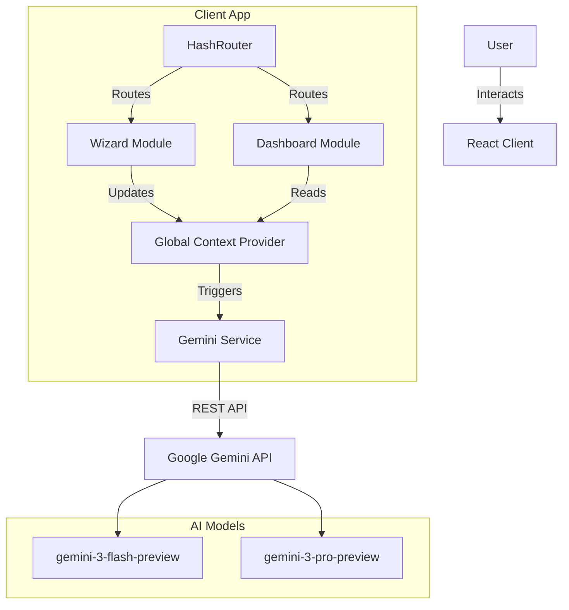
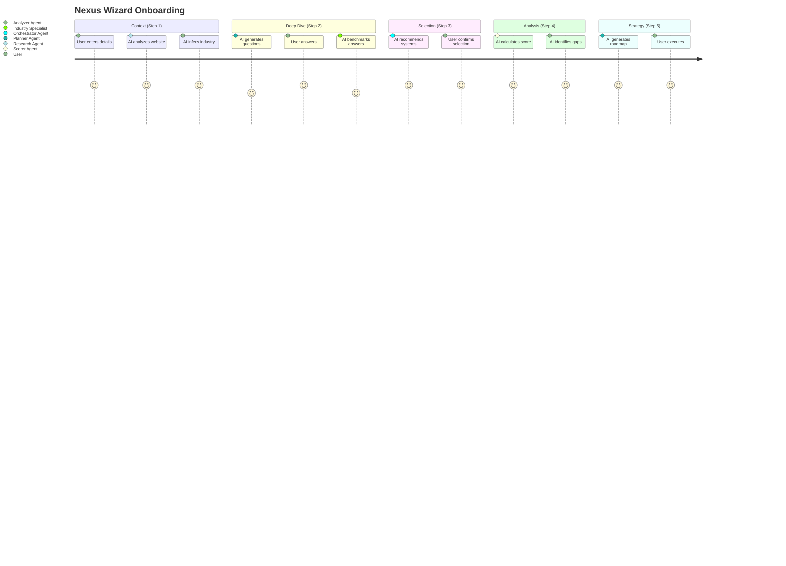
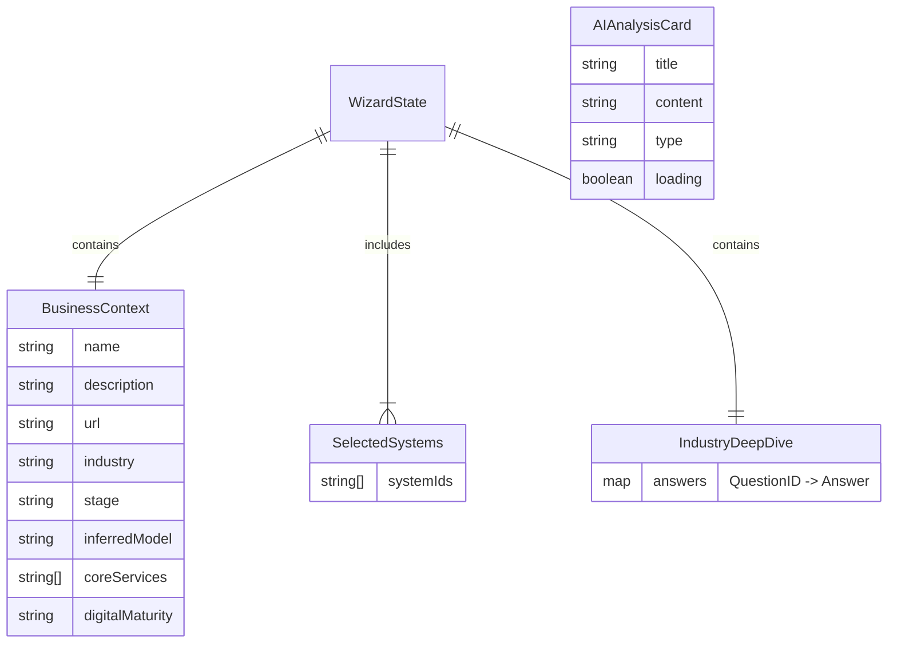
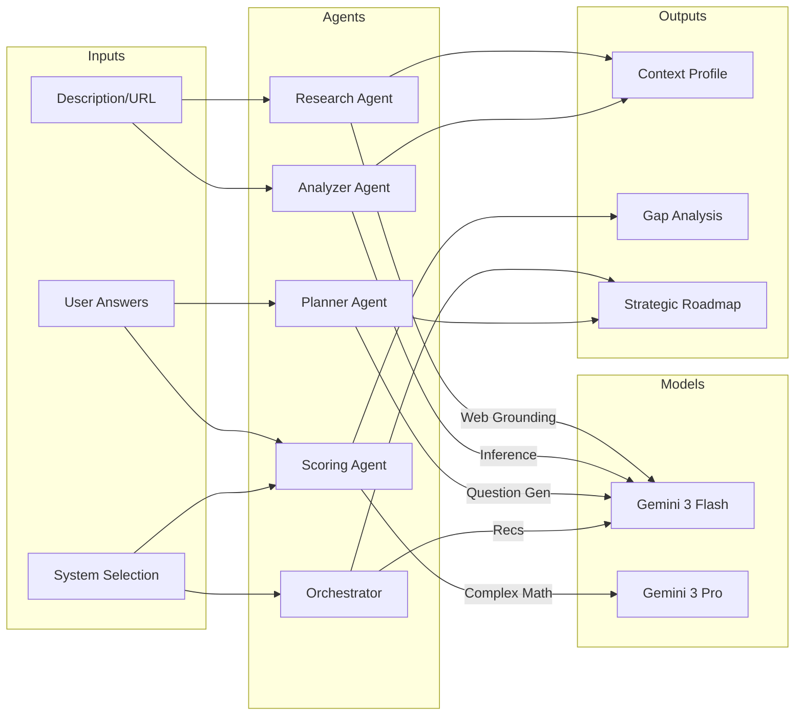
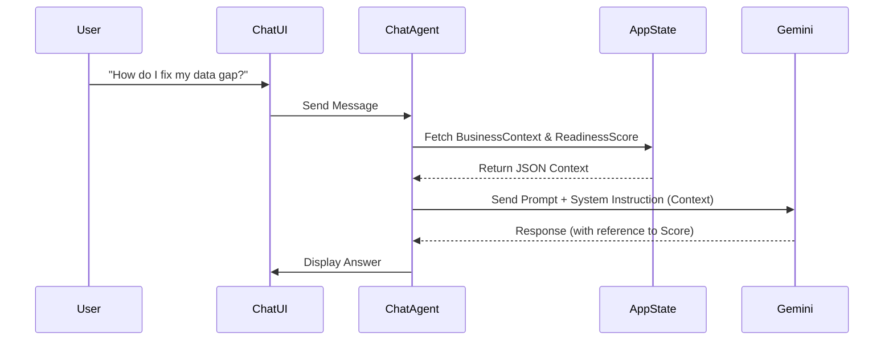

# Nexus Platform Architecture & Diagrams

## 1. System Architecture
High-level overview of the Client-Side architecture and AI integration.



## 2. Wizard User Journey
The linear progression through the intelligent onboarding process.



## 3. Data Model (State ERD)
Representation of the TypeScript interfaces driving the application state.



## 4. AI Agent Orchestration
How different agents interact with specific screens and the underlying Gemini models.



## 5. Dashboard State Consumption
How the Command Center renders based on the completed Wizard state.

```mermaid
flowchart TD
    State[WizardState (Complete)] -->|Read| Dash[Dashboard Component]
    
    Dash --> KPI[KPI Cards]
    Dash --> Tasks[Active Tasks]
    Dash --> AgentStat[Agent Status]
    
    State -->|Context.Readiness| KPI
    State -->|Context.Strategy| Tasks
    
    subgraph Live Intelligence
        Orch[Orchestrator Agent]
        Monitor[Monitor Loop]
    end
    
    Tasks -.->|Feed| Monitor
    Monitor -->|Update| Orch
    Orch -->|Suggestion| DashUI[Right Panel UI]
```

## 6. Chatbot Context Injection Flow
Shows how the Global Assistant retrieves context before sending to Gemini.


