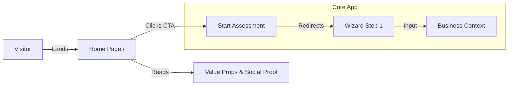

# Phase 1: Brand Identity & Marketing Layer

**Project:** Sun AI Agency
**Objective:** Establish the "Front Door" of the application. Replace "Nexus" branding with "Sun AI". Build the high-conversion landing page.
**Status:** 🔴 To Do

---

## 📊 Progress Tracker

- [ ] **Global Rebrand**: Replace "Nexus" string/logos with "Sun AI Agency".
- [ ] **Landing Page (`/`)**: Implement "Lux" design system (Hero, Services, Proof).
- [ ] **Routing Update**: Move Wizard to `/start` and make `/` the Landing Page.
- [ ] **Navigation**: Add "Start Assessment" CTA flow.

---

## 🧠 Feature & Agent Mapping

| Feature / Task | Gemini 3 Model | Capability / Tool | Agent Type | Logic / Workflow |
| :--- | :--- | :--- | :--- | :--- |
| **Hero Copy Generation** | Gemini 3 Pro | Text Generation | **Content/Comms** | Generate editorial headlines based on "Lux" persona. |
| **Service Descriptions** | Gemini 3 Flash | Structured Outputs | **Content/Comms** | Generate concise 2-sentence descriptions for 6 service cards. |
| **Rebrand Check** | N/A | IDE Search | **Controller** | Ensure no "Nexus" strings remain in codebase. |
| **User Flow** | N/A | React Router | **Orchestrator** | Route visitors from Home -> Auth -> Wizard Step 1. |

---

## 📐 Architecture Diagram (User Flow)



---

## ✅ Success Criteria & Production Checklist

1.  **Visual Consistency**: The "Lux" color palette (Deep Void, Starlight White, Agency Emerald) is applied to the Home Page AND the existing App.
2.  **No Dead Ends**: All buttons on the Home Page link to working routes (or anchors).
3.  **Performance**: Home page loads in < 1s (LCP).
4.  **Brand Integrity**: The word "Nexus" does not appear in the UI or metadata.

---

## 🤖 Implementation Prompts

### Step 1: Global Rebrand
```text
Act as a Senior Frontend Engineer.
1. Search the entire project for the string "Nexus".
2. Replace it with "Sun AI Agency" or "Sun AI".
3. Update `metadata.json` name and description.
4. Update `components/Layout/ThreePanelLayout.tsx` header text.
5. Update `index.html` title tag.
```

### Step 2: Home Page Structure
```text
Act as a UI/UX Designer. Create `features/website/HomePage.tsx`.
Refer to `docs/website/01-home.md` for the specific "Lux" design specs.
1. Implement the Hero Section with the gradient mesh background (Celestial Navy to Deep Void).
2. Implement the "Animated Word-by-Word" headline using Framer Motion or CSS keyframes.
3. Create the Glassmorphism Service Cards (2x3 Grid).
4. Use Tailwind colors: `bg-[#050508]` for body, text `white` and `#10B981` (Emerald) for accents.
```

### Step 3: Routing Update
```text
Act as a React Developer. Update `App.tsx`.
1. Create a new route for `/` that renders the `HomePage` component.
2. Change the Onboarding Wizard entry point to `/start` or `/wizard/step-1`.
3. Ensure the "Start Project" button on HomePage links to `/wizard/step-1`.
```
