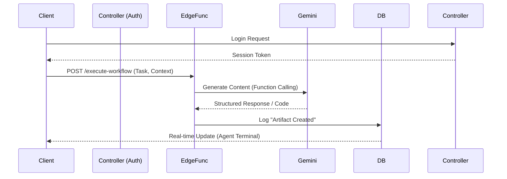

# Phase 2: Logic Core & Backend Integration

**Project:** Sun AI Agency
**Objective:** Connect the "Brain". Move from simulated client-side logic to real Supabase persistence and Edge Function execution.
**Status:** 🟡 Partially Started

---

## 📊 Progress Tracker

- [ ] **Supabase Auth**: Replace mock ID with real Auth (Login/Signup).
- [ ] **State Persistence**: Save `WizardState` to `client_contexts` table.
- [ ] **Workflow Engine**: Deploy `execute-workflow` Edge Function.
- [ ] **Real-Time Logs**: Connect `AgentTerminal` to Supabase Realtime/Logs table.

---

## 🧠 Feature & Agent Mapping

| Feature / Task | Gemini 3 Model | Capability / Tool | Agent Type | Logic / Workflow |
| :--- | :--- | :--- | :--- | :--- |
| **Workflow Logic** | Gemini 3 Pro | **Code Execution** | **Executor** | Generate and execute Python/JS code for complex tasks. |
| **Auth Gating** | N/A | Supabase Auth | **Controller** | Prevent unauthorized access to Dashboards. |
| **Task Analysis** | Gemini 3 Flash | **Structured Outputs** | **Extractor** | Parse user intent from "Run Workflow" clicks into JSON args. |
| **Readiness Audit** | Gemini 3 Flash | **Gemini Thinking** | **Scorer** | Calculate scores using server-side logic (prevent client tampering). |

---

## 📐 Architecture Diagram (Data Flow)



---

## ✅ Success Criteria & Production Checklist

1.  **Data Safety**: User data persists after browser refresh (fetched from DB, not LocalStorage).
2.  **Security**: Row Level Security (RLS) is enabled. Users can only see their own companies.
3.  **Reliability**: Workflow Edge Functions handle timeouts gracefully (Gemini API latency).
4.  **Feedback**: The "Agent Terminal" shows real server logs, not mock arrays.

---

## 🤖 Implementation Prompts

### Step 1: Supabase Setup
```text
Act as a Backend Engineer.
1. Create `services/supabase.ts` and initialize the client using `VITE_SUPABASE_URL` and `VITE_SUPABASE_ANON_KEY`.
2. Create a Context Provider `AuthProvider` that manages the user session.
3. Update `App.tsx` to wrap protected routes in a `<RequireAuth>` component.
```

### Step 2: Database Persistence
```text
Act as a Full Stack Engineer.
1. Update `context/AppContext.tsx`.
2. Instead of saving `wizardState` to localStorage, create a `saveWizardState` function that upserts to the `client_contexts` table in Supabase.
3. Use a `useEffect` to load data from Supabase on mount if a user is logged in.
```

### Step 3: Edge Function Connection
```text
Act as an AI Engineer. Update `services/workflowService.ts`.
1. Remove the `localWorkflowStore` map.
2. Update `startWorkflow` to strictly call the Supabase Edge Function `execute-workflow`.
3. Update `getWorkflowLogs` to query the `workflow_logs` table in Supabase (using `.select('*').eq('workflow_id', id)`).
4. Ensure the `AgentTerminal` component subscribes to changes on `workflow_logs` for real-time updates.
```
