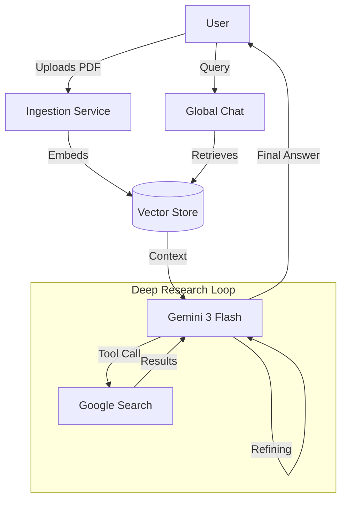

# Phase 3: Advanced Intelligence & Scaling

**Project:** Sun AI Agency
**Objective:** The "Magic". Implement features that differentiate Sun AI from basic wrappers: Deep Research, RAG, and multi-modal generation.
**Status:** ⚪ Planned

---

## 📊 Progress Tracker

- [ ] **Deep Research Agent**: Autonomous competitor analysis using loop-based search.
- [ ] **Knowledge Base (RAG)**: Ingest client PDFs/URLs for "Chat with your Business".
- [ ] **Vertical Intelligence**: Google Maps Grounding for Real Estate/Travel clients.
- [ ] **Visual Gen**: Nano Banana model for generating marketing assets.

---

## 🧠 Feature & Agent Mapping

| Feature / Task | Gemini 3 Model | Capability / Tool | Agent Type | Logic / Workflow |
| :--- | :--- | :--- | :--- | :--- |
| **Competitor Scan** | Gemini 3 Pro | **Deep Research** | **Analyst** | Recursive search to find pricing/features of competitors. |
| **Doc Q&A** | Gemini 3 Flash | **RAG** / Retriever | **Retriever** | Embed documents -> Vector Store -> Context Retrieval. |
| **Location Audit** | Gemini 3 Pro | **Grounding (Maps)** | **Analyst** | "Find top 5 competitors near [Client Location]". |
| **Ad Creative** | Gemini Nano | **Image Generation** | **Content** | Generate social media thumbnails (Nano Banana). |
| **Report Approval**| Gemini 3 Flash | **Interactions API** | **Controller** | Human-in-the-loop approval before sending emails. |

---

## 📐 Architecture Diagram (RAG & Research)



---

## ✅ Success Criteria & Production Checklist

1.  **Accuracy**: RAG answers must cite sources (page numbers/URLs).
2.  **Latency**: Deep Research queries must provide interim status updates ("Searching...", "Reading...") to prevent timeouts.
3.  **Visuals**: Image generation must strictly follow the client's brand color palette instructions.
4.  **Fallback**: If Maps/Search fails, the system must gracefully degrade to general knowledge.

---

## 🤖 Implementation Prompts

### Step 1: Deep Research Agent
```text
Act as an AI Engineer. Create `services/ai/deepResearch.ts`.
1. Define a function `performCompetitorAnalysis(companyName, industry)`.
2. Use Gemini 3 Pro with `googleSearch` tool.
3. Enable **Gemini Thinking** (set budget to 2048 tokens) to allow it to plan the search strategy.
4. Instruct it to find: Pricing models, Key features, and Customer sentiment of 3 top competitors.
5. Return structured JSON.
```

### Step 2: Maps Integration (Vertical Specific)
```text
Act as a Full Stack Developer.
1. Update `services/ai/contextAnalysis.ts`.
2. If `industry === 'Real Estate'` or `'Retail'`, inject the `googleMaps` tool into the Gemini config.
3. Update the system prompt: "If the user provides a location, use Google Maps to identify local market saturation."
```

### Step 3: RAG Service (Preparation)
```text
Act as a Backend Engineer.
1. Design the `documents` table schema in Supabase (id, client_id, content, embedding vector(768)).
2. Create a Supabase Edge Function `ingest-document` that:
   - Accepts text/PDF.
   - Chunks text.
   - Calls `ai.models.embedContent` (text-embedding-004).
   - Stores vectors in DB.
```
