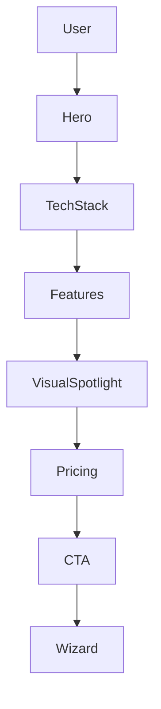

# Design Plan: AI Web Development

**Page Type:** Service Detail Page
**Route:** `/services/ai-web-dev`
**Design System:** Sun AI "Lux" (FashionOS Variant)
**Status:** Design Specification

---

## 1️⃣ Page Strategy & UX Intent

**Purpose:**
To position "Web Development" not as a commodity service, but as **Digital Architecture**. We are building the "Flagship Store" or "Headquarters" for the client's AI strategy.

**Problem Solved:**
Founders fear "spaghetti code," slow agencies, and non-scalable MVPs. They want a platform that looks like a Series B product on Day 1.

**User Decision:**
"I am done with freelancers. I need a robust, scalable, AI-ready foundation. I will start the brief."

**Luxury Analogy:**
**The Pritzker Prize Architect.** We don't just stack bricks; we design intelligent environments where form follows function. The code is the structure; the AI is the electricity.

---

## 2️⃣ Information Architecture

1.  **Hero Section:** "The Digital Flagship." Sets the standard for speed and aesthetics.
2.  **Tech Stack Showcase:** "The Materials." displaying React/Next.js/Supabase as premium raw materials.
3.  **Core Features Grid:** "The Blueprint." 6 pillars of the service (Frontend, Backend, AI, etc.).
4.  **Visual Spotlight (Dashboard):** "The View." A high-fidelity mockup of what we build.
5.  **Process Timeline:** "The Construction Schedule." 8-week delivery promise.
6.  **Case Studies:** "The Portfolio." Proven excellence.
7.  **Pricing Tiers:** "The Investment." Transparent, high-value packages.
8.  **FAQ:** "The Details." Addressing technical constraints.
9.  **Footer CTA:** "Groundbreaking." Start the project.

---

## 3️⃣ Scroll-Driven Storytelling Flow

*   **Scroll 0% (Hero):** *Awe.* Large typography, subtle code-based background animations. The feeling of "Modern".
*   **Scroll 20% (Stack):** *Competence.* Logos of Next.js, React, Vercel displayed like luxury brand logos. Minimalist, monochrome.
*   **Scroll 40% (Features):** *Clarity.* Glassmorphism cards explaining exactly what is included. No ambiguity.
*   **Scroll 60% (Visuals):** *Desire.* Large, beautiful screenshots of dashboards. The user imagines their own data looking this good.
*   **Scroll 80% (Pricing/Process):** *Trust.* We hide nothing. The timeline is fixed. The price is fixed.
*   **Scroll 100% (CTA):** *Action.* A singular, confident button to begin.

---

## 4️⃣ Wireframe Layout (Text-Based)

```text
[ HERO ]
Centered Headline (Playfair)
Subheadline (Inter)
[ Pill: 8-Week Launch ] [ Pill: AI-First ]
[ CTA Button ]
|
(Background: Abstract Code Mesh)

[ TECH STACK MARQUEE ]
Next.js • React • TypeScript • Supabase • Vercel
(Monochrome, slow scroll)

[ FEATURE GRID ]
[ Card 1: Frontend ]  [ Card 2: Backend ]  [ Card 3: AI ]
[ Card 4: Design   ]  [ Card 5: Dashboards] [ Card 6: DevOps ]
(Glassmorphism, Icons Top Left)

[ VISUAL SPOTLIGHT ]
(Full Width Container)
Image: Tilted 3D Dashboard Mockup
Overlay Text: "Executive-Grade UX"

[ PRICING TIERS ]
[ Starter ]  [ Professional (Highlighted) ]  [ Enterprise ]
(Vertical Cards, Checklists)

[ CASE STUDIES ]
[ Text Left ] [ Image Right ]
[ Image Left ] [ Text Right ]

[ FAQ ACCORDION ]
(Clean lines, minimalist)

[ FOOTER CTA ]
"Start Your Project"
```

---

## 5️⃣ UI Layout & Visual System Rules

*   **Glassmorphism:** Used for Feature Cards and Pricing. Background `rgba(255,255,255,0.03)`, Border `rgba(255,255,255,0.1)`.
*   **Gradients:** "Purple-to-Pink" (`#667eea` to `#f093fb`) used *sparingly* on active states, buttons, and iconic accents.
*   **Whitespace:** Minimum `120px` padding between sections.
*   **Images:** All dashboard mockups must have "soft shadows" and rounded corners (`xl` or `2xl`).

---

## 6️⃣ Typography & Visual Hierarchy

*   **H1:** Playfair Display, 72px. Tight tracking.
*   **H2:** Playfair Display, 48px.
*   **H3:** Inter, 20px, Uppercase tracking.
*   **Body:** Inter, 16px, `text-slate-500`.
*   **Accents:** Gradient text for "AI-Powered" and ROI numbers.

---

## 7️⃣ Responsive Design Best Practices

*   **Mobile:**
    *   Hero headline scales to 48px.
    *   Feature Grid becomes 1 column.
    *   Tech Stack Marquee wraps to 2 rows.
    *   Pricing cards stack vertically.
*   **Tablet:**
    *   Feature Grid is 2 columns.
    *   Pricing uses horizontal scroll or 2-up grid.

---

## 8️⃣ Navigation, Routes & Links

*   **Primary CTA:** `/wizard/step-1` (Start Project)
*   **Secondary CTA:** `#case-studies` (Anchor)
*   **Breadcrumbs:** Home > Services > Web Development
*   **Related Services:** Link to `/services/ai-development` in footer.

---

## 9️⃣ Diagrams & Visual Aids



---

## 🔟 Multi-Step DESIGN PROMPTS

### 1. Hero Section
> "Create a Hero Section. Headline: 'AI-Powered Web Development That Scales' in Playfair Display (72px). Subhead in Inter (slate-500). Background: Deep Void (#050508) with a subtle purple-to-pink gradient mesh in the top right corner. Two buttons: Primary (Gradient bg) and Secondary (Glass border). Right side: A floating, tilted glass card showing a code snippet."

### 2. Tech Stack Strip
> "Create a full-width logo strip. Background: Darker shade of void (#020203). Content: 5-7 Logos (Next.js, React, Supabase, Tailwind, Vercel) in pure white with 40% opacity. On hover, logos turn full opacity and reveal their brand color. Infinite horizontal scroll animation."

### 3. Feature Grid (Glass)
> "Create a 3x2 Grid. Cards use Glassmorphism: `bg-white/5 backdrop-blur-lg border-white/10`. Inside each card: A gradient icon (purple/pink) top left, Serif Headline (24px), Sans body text. Hover effect: The border glows purple (`border-purple-500/50`) and the card lifts -5px."

### 4. Pricing Tiers
> "Create 3 Pricing Cards. 'Starter', 'Professional', 'Enterprise'. The 'Professional' card is scaled 1.05x, has a gradient border (purple-to-pink), and a 'Best Value' floating pill at the top. List features with green checkmarks. Price is large Serif font (56px). CTA button at bottom of each."

### 5. Visual Spotlight
> "Create a 'Breakout' section. Background is white (contrast). Left side: Sticky content describing 'Dashboard Systems'. Right side: A scrolling vertical list of high-fidelity dashboard screenshots (Mobile responsive view, Analytics view, Dark mode view). Images have deep drop shadows."

---

## 1️⃣1️⃣ Performance & Accessibility

*   **Contrast:** Ensure purple text on dark backgrounds is WCAG AA compliant.
*   **Images:** Use WebP for dashboard screenshots. Lazy load everything below the fold.
*   **Motion:** Use `prefers-reduced-motion` to disable the infinite marquee for sensitive users.
