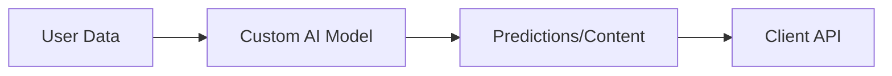

# Design Plan: AI Development & Integration

**Page Type:** Service Detail Page
**Route:** `/services/ai-development`
**Design System:** Sun AI "Lux" (FashionOS Variant)
**Status:** Design Specification

---

## 1️⃣ Page Strategy & UX Intent

**Purpose:**
To clarify "Custom AI". This isn't just chatting with ChatGPT. This is engineering. We are building the "Brain" of the company.

**Problem Solved:**
Clients know they need AI but don't know *how* to apply it to their specific data. They fear hallucinations and security risks.

**User Decision:**
"They understand the difference between a wrapper and a custom model. I trust them with my data."

**Luxury Analogy:**
**The Bespoke Tailor (Savile Row).** Off-the-rack (ChatGPT) is fine for most, but you need a fit that matches your exact measurements (Data).

---

## 2️⃣ Information Architecture

1.  **Hero Section:** "The Custom Brain." Focus on proprietary data and specialized models.
2.  **Capabilities Grid:** "The Skillset." NLP, Computer Vision, Predictive Analytics.
3.  **Model Comparison:** "The Fabric Selection." GPT-4 vs Claude vs Llama (Open Source).
4.  **Integration Logic:** "The Fit." How it plugs into existing APIs.
5.  **ROI Calculator:** "The Value." Interactive tool.
6.  **Testimonials:** "The Client List."
7.  **Process:** "The Fittings." Discovery -> Prototype -> Production.
8.  **CTA:** "Book Measurement."

---

## 3️⃣ Scroll-Driven Storytelling Flow

*   **Scroll 0% (Hero):** *Intelligence.* Animated nodes connecting. Deep Purple (`#9c27b0`) and Cyan (`#00d4ff`) accents.
*   **Scroll 25% (Capabilities):** *Possibility.* Icons representing Vision, Voice, and Text. The user realizes AI is more than just text.
*   **Scroll 50% (Comparison):** *Education.* A clean table comparing models. The user feels smarter/informed.
*   **Scroll 75% (ROI):** *Logic.* An interactive slider. "If I automate 50%, I save $X." The emotional buy-in becomes logical justification.
*   **Scroll 100% (CTA):** *Partnership.* "Let's build *your* model."

---

## 4️⃣ Wireframe Layout (Text-Based)

```text
[ HERO ]
"Custom AI Development for Modern Business"
[ Animated Brain/Network Visual ]
[ CTA: Discuss Project ]

[ CAPABILITIES GRID ]
[ Card: NLP ] [ Card: Vision ] [ Card: Voice ] [ Card: Prediction ]
(Icons are animated on hover)

[ MODEL COMPARISON TABLE ]
(Columns: GPT-4, Claude, Custom, Open Source)
(Rows: Speed, Cost, Privacy, IQ)
(Highlight 'Custom' column)

[ INTEGRATION DIAGRAM ]
[ Your Data ] --> [ Sun AI API ] --> [ Your App ]
(Horizontal flow with arrows)

[ ROI CALCULATOR ]
[ Input: Hours/Week ] [ Input: Hourly Rate ]
[ Output: $ Saved/Year ] (Big typography)

[ PROCESS STEPS ]
1. Discovery -> 2. Prototype -> 3. Production
(Horizontal connected dots)

[ CTA FOOTER ]
```

---

## 5️⃣ UI Layout & Visual System Rules

*   **Theme:** "Deep Mind." Darker backgrounds than Web Dev. More usage of the `void` color.
*   **Accents:** Cyan and Purple gradients.
*   **Table Styles:** Minimalist rows. No vertical lines. Header row is sticky or bold.
*   **Visuals:** Abstract geometric shapes (dodecahedrons, networks) representing neural nets.

---

## 6️⃣ Typography & Visual Hierarchy

*   **H1:** Playfair Display.
*   **Numbers:** Use Monospace font (JetBrains Mono or similar) for the ROI calculator and data metrics to imply engineering precision.
*   **Tables:** Inter, small text, high legibility.

---

## 7️⃣ Responsive Design Best Practices

*   **Comparison Table (Mobile):** Collapse into specific cards ("GPT-4 Card", "Claude Card") or allow horizontal scroll with sticky first column.
*   **ROI Calculator:** Stack inputs vertically. Result stays pinned to bottom or top.

---

## 8️⃣ Navigation, Routes & Links

*   **Primary CTA:** `/contact` (Discuss Project)
*   **Secondary CTA:** `#capabilities`
*   **Breadcrumbs:** Home > Services > AI Development

---

## 9️⃣ Diagrams & Visual Aids



---

## 🔟 Multi-Step DESIGN PROMPTS

### 1. Hero Section (AI Network)
> "Create a Hero Section. Headline: 'Custom AI Development for Modern Businesses' (Playfair). Background: An interactive particle network (nodes and lines) using `canvas`. Nodes connect when close. Gradient: Deep Purple to Cyan. The network tracks the mouse cursor slightly."

### 2. Capabilities Grid
> "Create a 4x2 Grid. Cards are dark (`bg-slate-900`) with a 1px gradient border (purple-to-cyan). Inside: Large thin-line icon (white), Bold Title, text description. On hover: The background fills with a low-opacity gradient."

### 3. Comparison Table
> "Create a Comparison Table. 4 Columns. Header row has a glass background (`backdrop-blur`). Rows have hover effects (`bg-white/5`). Use checkmarks (green) and stars (yellow) for ratings. The 'Custom Fine-Tune' column should have a subtle glowing border to highlight it as the premium option."

### 4. ROI Calculator
> "Create an interactive component. Left side: 3 Range Sliders (Hours, Cost, % Automation). Right side: A 'Result Card' that updates in real-time. The result number uses a Monospace font and counts up (animation) when inputs change. Background: Glassmorphism on top of a gradient blob."

### 5. Integration Flow
> "Create a visual flow diagram. 'Your Database' (Icon) -> dotted line (animated) -> 'Sun AI Engine' (Central Pulsing Icon) -> dotted line -> 'Your Dashboard' (Icon). Use SVG arrows."

---

## 1️⃣1️⃣ Performance & Accessibility

*   **Canvas:** Ensure the hero particle animation pauses when the tab is inactive to save battery.
*   **Calculator:** Inputs must have associated labels for screen readers.
*   **Color:** Cyan text on white background can be hard to read; use a darker shade of Cyan/Teal for text.
