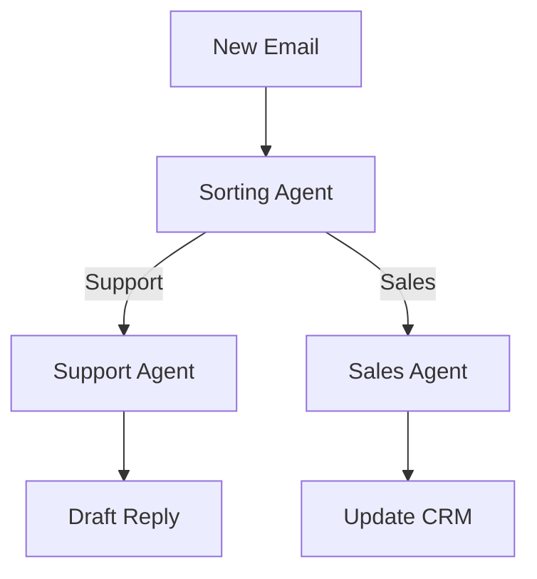

# Design Plan: AI Agents & Multi-Agent Systems

**Page Type:** Service Detail Page
**Route:** `/services/ai-agents`
**Design System:** Sun AI "Lux" (FashionOS Variant)
**Status:** Design Specification

---

## 1️⃣ Page Strategy & UX Intent

**Purpose:**
To sell "Autonomy." Agents are not just chatbots; they are digital employees. We need to visualize the *work* being done without human intervention.

**Problem Solved:**
Founders are overwhelmed by operational drag. They want to clone themselves or their best employees.

**User Decision:**
"This is the leverage I've been looking for. I can scale without hiring 10 more people."

**Luxury Analogy:**
**The Executive Concierge Service (Quintessentially).** You don't tell them *how* to book the table; you just say "Dinner at 8," and it happens.

---

## 2️⃣ Information Architecture

1.  **Hero Section:** "Work While You Sleep." Visualization of agents active 24/7.
2.  **Agent Types:** "The Team." Support, Sales, Data, Research.
3.  **Workflow Visualization:** "The Logic." Interactive diagram showing step-by-step agent coordination.
4.  **Use Cases (Tabs):** "The Application." Real-world scenarios (e.g., Order Fulfillment).
5.  **Architecture:** "The Brain." Interface -> Processing -> Orchestration.
6.  **Pricing (Configurator):** "The Payroll." Cost per agent vs human.
7.  **FAQ:** Safety and control.
8.  **CTA:** "Deploy Your Agents."

---

## 3️⃣ Scroll-Driven Storytelling Flow

*   **Scroll 0% (Hero):** *Magic.* The headline promises 24/7 work. The visual shows a globe or clock with activity spikes.
*   **Scroll 30% (Workflow):** *Fascination.* The user watches a "task" move through a pipeline. Order -> Stock Check -> Email. It clicks: "Oh, it handles the *whole* process."
*   **Scroll 60% (Use Cases):** *Relevance.* "Sales Qualification? Yes, I need that." The user identifies their pain point.
*   **Scroll 90% (Pricing):** *Value.* Comparing $2k/mo for an agent vs $5k/mo for a human.
*   **Scroll 100% (CTA):** *Deployment.*

---

## 4️⃣ Wireframe Layout (Text-Based)

```text
[ HERO ]
"Build AI Agents That Work While You Sleep"
[ Animation: Nodes orbiting a central core ]
[ Stats: 24/7 Active | 0 Sick Days ]

[ AGENT ROSTER (Grid) ]
[ Card: Support Agent ] [ Card: Sales Agent ] [ Card: Research Agent ]
(Each card looks like an ID badge or employee profile)

[ INTERACTIVE WORKFLOW ]
(Left: Input) -> [ Agent 1 ] -> [ Agent 2 ] -> (Right: Output)
(Animated dots flowing along the path)

[ USE CASE TABS ]
[ E-Commerce ] [ SaaS ] [ Legal ]
(Clicking tab changes the content/diagram below)

[ ARCHITECTURE LAYER ]
[ Interface Layer ]
[ Processing Layer ]
[ Orchestration Layer ]
(Stacked blocks, isometric view)

[ PRICING CONFIGURATOR ]
"How many agents do you need?"
[ Slider: 1 - 10 ]
Estimated Cost: $X
Estimated Savings: $Y

[ CTA ]
```

---

## 5️⃣ UI Layout & Visual System Rules

*   **Theme:** "Orange & Deep Purple." Orange (`#f57c00`) represents *action/execution*. Purple represents *intelligence*.
*   **Motion:** Constant subtle motion. Agents are "alive." Pulsing dots, flowing lines.
*   **Cards:** "Employee Badge" style. Photo placeholder (robot avatar), Role Title, Capabilities list.

---

## 6️⃣ Typography & Visual Hierarchy

*   **H1:** Playfair Display.
*   **Labels:** "Agent Active", "Task Complete" styled like terminal logs or status indicators (`font-mono`, small, uppercase).
*   **Diagrams:** Clean, thin lines. Labels are critical for understanding the flow.

---

## 7️⃣ Responsive Design Best Practices

*   **Workflow Animation (Mobile):** Convert horizontal flow to vertical flow (Top-to-Bottom).
*   **Tabs:** Use a dropdown or horizontal scroll on mobile.

---

## 8️⃣ Navigation, Routes & Links

*   **Primary CTA:** `/app/brief-wizard` (Build Agent)
*   **Breadcrumbs:** Home > Services > AI Agents

---

## 9️⃣ Diagrams & Visual Aids



---

## 🔟 Multi-Step DESIGN PROMPTS

### 1. Hero Section (Orbit)
> "Create a Hero Section. Headline: 'AI Agents That Work While You Sleep'. Background: A central glowing core (The Brain) with 6 satellite nodes (Agents) orbiting it slowly. Use Orange (`#f57c00`) for the active nodes. The orbit paths are visible thin lines. CTA: 'Deploy Agents'."

### 2. Agent Roster (ID Cards)
> "Create a Grid of 'Employee Cards'. Layout: Glassmorphism card. Top: Circle Avatar (Abstract bot face). Middle: Role Title (e.g., 'Sales Qualifier'). Bottom: 3 Bullet points of skills. Visual detail: A small 'Online' green dot in the top right of each card."

### 3. Workflow Visualizer
> "Create a Horizontal Process Diagram. Step 1: Trigger Icon. Arrow to Step 2: Agent Icon (Pulsing). Arrow to Step 3: Result Icon. Animate a small gradient ball traveling along the path connector lines. Loop the animation. Labels below each step."

### 4. Pricing Configurator
> "Create a Split Card. Left side: Form controls (Slider for number of agents, Toggle for '24/7 Support'). Right side: A receipt-style summary. 'Human Cost: $50,000' (Strikethrough). 'Agent Cost: $12,000'. 'Savings: $38,000'. Use Green text for the savings."

---

## 1️⃣1️⃣ Performance & Accessibility

*   **Motion:** The orbiting animation in the hero can be distracting. Ensure it pauses on interaction or respects reduced motion settings.
*   **Contrast:** Orange on white is tricky. Use a high-contrast orange (`#e65100`) for text, lighter orange for graphics.
