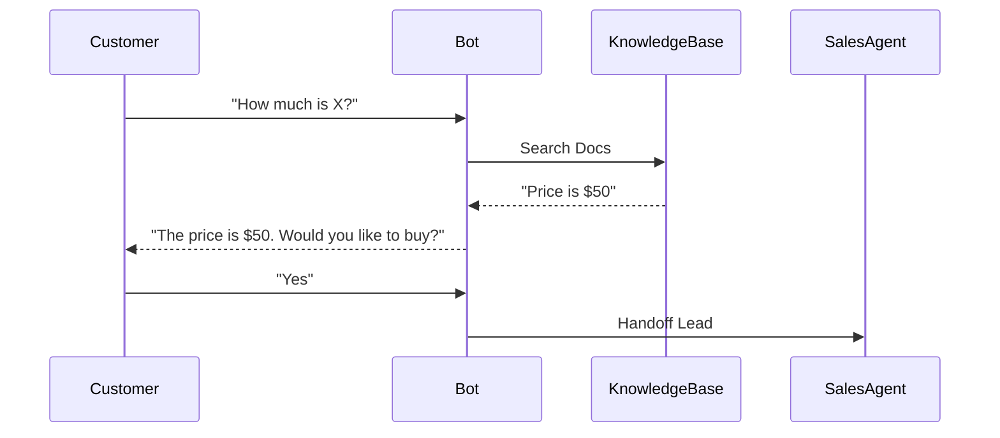

# Design Plan: AI Chatbots

**Page Type:** Service Detail Page
**Route:** `/services/ai-chatbots`
**Design System:** Sun AI "Lux" (FashionOS Variant)
**Status:** Design Specification

---

## 1️⃣ Page Strategy & UX Intent

**Purpose:**
To upgrade the perception of chatbots from "annoying popups" to "intelligent concierges."

**Problem Solved:**
Businesses lose leads because they can't answer questions instantly at 2 AM. Support costs are too high.

**User Decision:**
"I need this to capture leads while I sleep. It pays for itself."

**Luxury Analogy:**
**The 5-Star Hotel Reception.** It’s not a guard; it’s a host. It welcomes you, knows your name, and guides you to the lounge.

---

## 2️⃣ Information Architecture

1.  **Hero Section:** "Understand, Don't Just Reply." Live interactive demo in the hero.
2.  **Comparison:** "Old Chatbots vs Sun AI." Rules vs Reasoning.
3.  **Channel Showcase:** WhatsApp, Web, SMS, Slack. "Everywhere your customers are."
4.  **Features:** Sentiment Analysis, Handoff, Knowledge Base.
5.  **Analytics:** "The Dashboard." Seeing the conversations.
6.  **Pricing:** Usage-based or Flat fee.
7.  **CTA:** "Build Your Bot."

---

## 3️⃣ Scroll-Driven Storytelling Flow

*   **Scroll 0% (Hero):** *Engagement.* The user sees a chat widget. It types "How can I help you?". It invites interaction immediately.
*   **Scroll 25% (Comparison):** *Relief.* We acknowledge that old chatbots sucked. We promise ours are different (GPT-4).
*   **Scroll 50% (Channels):** *Scale.* The user realizes this isn't just for the website; it's for WhatsApp too.
*   **Scroll 75% (Analytics):** *Control.* Showing the data dashboard. "Oh, I can see what people are asking."
*   **Scroll 100% (CTA):** *Ownership.*

---

## 4️⃣ Wireframe Layout (Text-Based)

```text
[ HERO ]
Left: "AI Chatbots That Actually Understand"
Right: [ Live Chat Widget Mockup ]
(Simulated conversation bubbling up)

[ COMPARISON TABLE ]
[ Traditional Bot ] vs [ Sun AI Bot ]
(Keywords, Trees)      (Intent, GPT-4)
(Frustrating)          (Natural)

[ CHANNEL ICONS ]
[ WhatsApp ] [ Web ] [ SMS ] [ Slack ]
(Large icons, colorful brand colors)

[ FEATURE LIST ]
[ Sentiment Analysis ] [ Human Handoff ] [ Lead Capture ]
(Icon + Text)

[ ANALYTICS PREVIEW ]
(Image of a graph showing 'Resolution Rate: 78%')

[ PRICING ]
[ Starter ] [ Professional ] [ Enterprise ]

[ CTA ]
```

---

## 5️⃣ UI Layout & Visual System Rules

*   **Theme:** "Cyan & Green." Cyan (`#00bcd4`) for technology, Green (`#25d366`) for WhatsApp/Success.
*   **Chat Bubbles:** The primary visual motif. Rounded corners, glassmorphism backgrounds.
*   **Avatars:** High-quality profile circles.

---

## 6️⃣ Typography & Visual Hierarchy

*   **H1:** Playfair Display.
*   **Chat Text:** Inter, 14px. Very legible.
*   **Stats:** Large, bold numbers for "70% Cost Reduction".

---

## 7️⃣ Responsive Design Best Practices

*   **Hero (Mobile):** The Chat Widget mockup moves *below* the headline.
*   **Channels:** Grid of 2x2 instead of 4x1.

---

## 8️⃣ Navigation, Routes & Links

*   **Primary CTA:** `/app/brief-wizard` (Build Chatbot)
*   **Breadcrumbs:** Home > Services > AI Chatbots

---

## 9️⃣ Diagrams & Visual Aids



---

## 🔟 Multi-Step DESIGN PROMPTS

### 1. Hero Section (Live Chat)
> "Create a Hero Section. Left side: Headline 'AI Chatbots That Actually Understand' (Playfair). Right side: A floating Phone Mockup. Inside the phone: A chat interface. Animate message bubbles popping up: 'User: Return policy?', 'Bot: 30 days, free shipping. Need a label?'. Background: Soft Cyan gradient."

### 2. Channel Showcase
> "Create a 4-column row. Each column features a massive icon (WhatsApp, SMS, Web, Slack). Below the icon: 'WhatsApp Business' (Bold). On hover: The card background changes to the brand color of the platform (e.g., WhatsApp Green) and text turns white."

### 3. Analytics Dashboard Mockup
> "Create a 'Faux Dashboard' visual. A card showing a Line Graph (Conversations over time). 3 Stat Cards at top: 'Resolution Rate: 78%', 'Avg Response: 1.2s', 'CSAT: 4.9'. Use a clean, white UI style with soft drop shadows."

### 4. Comparison Table
> "Create a 'Before & After' style comparison. Left Column: 'Old Way' (Red X icons, gray text). Right Column: 'Sun AI Way' (Green Check icons, black text, highlighted background). Rows: Intelligence, Setup Time, Languages, Handoff."

---

## 1️⃣1️⃣ Performance & Accessibility

*   **Chat Widget:** Ensure the mockup text has high contrast.
*   **Animations:** The "typing" animation should not be too fast or flash rapidly.
