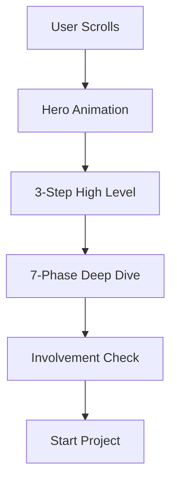

# Design Plan: Process & Methodology

**Page Type:** Marketing / Trust Building
**Route:** `/process`
**Design System:** Sun AI "Lux" (FashionOS Variant)
**Status:** Design Specification

---

## 1️⃣ Page Strategy & UX Intent

**Purpose:**
To demystify the "black box" of AI development. We transform anxiety ("Will this project fail?") into confidence ("They have a rigorous system").

**Problem Solved:**
Clients fear scope creep, missed deadlines, and "spaghetti code." They want assurance that the agency follows a disciplined engineering standard.

**User Decision:**
"This isn't a freelance gig; this is a manufacturing process. I feel safe investing $50k+ here."

**Luxury Analogy:**
**The Swiss Watch Manufacture.** A transparent glass factory where you watch raw metal (ideas) turn into a precision chronometer (software) through a series of visibly distinct, expert steps.

---

## 2️⃣ Information Architecture

1.  **Hero / Interactive Scroll:** "The Smarter Way." A sticky, scroll-driven narrative explaining the 3-step core flow (Scope -> Blueprint -> Dashboard).
2.  **The 7-Phase Timeline:** "The Granular Details." Deep dive into the 8-12 week schedule.
3.  **Deliverables Matrix:** "What You Get." Concrete artifacts per phase.
4.  **Client Role:** "Your Involvement." Setting expectations (Low vs High touch).
5.  **Comparison:** "Us vs Them." Systematic vs Ad-hoc.
6.  **CTA:** "Start Phase 1."

---

## 3️⃣ Scroll-Driven Storytelling Flow

*   **Scroll 0-30% (The Hook):** *Fascination.* The user enters the "How It Works" section. The screen locks. A ghost cursor animates on a sticky browser frame, simulating the onboarding wizard. They see the speed of the system.
*   **Scroll 30-60% (The Logic):** *Clarity.* The timeline unfolds. Week 1, Week 2, Week 3. It feels rhythmic and predictable.
*   **Scroll 60-90% (The Assurance):** *Relief.* The "Client Involvement" section shows they won't be overwhelmed. The "Deliverables" section shows tangible value.
*   **Scroll 100% (Action):** *Commitment.* The CTA invites them to begin the exact process they just witnessed.

---

## 4️⃣ Wireframe Layout (Text-Based)

```text
[ HERO: INTERACTIVE SCROLL ]
Left Col: Scrolling Text ("1. Scope", "2. Blueprint", "3. Dashboard")
Right Col: Sticky Browser Frame (Simulated screens changing)
(Deep Void Background)

[ 7-PHASE TIMELINE ]
Heading: "From Idea to Launch in 8 Weeks"
[ Phase 1 Node ] ---- [ Phase 2 Node ] ---- [ Phase 3 Node ] ...
(Horizontal scroll or vertical stack on mobile)
[ Expanded Details Panel: Deliverables Checklist ]

[ CLIENT INVOLVEMENT MATRIX ]
Table-style layout:
[ Phase ] [ Your Time ] [ Activities ]
(Row 1: Discovery | 8 hrs | Workshops)
(Row 2: Dev       | 2 hrs | Approval)

[ METHODOLOGY COMPARISON ]
[ Us ]           [ Agency ]      [ Freelancer ]
(Green Check)    (Yellow ~)      (Red X)
(Systematic)     (Slow)          (Chaos)

[ CTA FOOTER ]
"Ready to start Phase 1?"
```

---

## 5️⃣ UI Layout & Visual System Rules

*   **Backgrounds:** Alternating between `Deep Void` (#050508) for high-impact sections (Hero) and `Snow Slate` (#FAFAFA) for information-heavy sections (Timeline, Matrix).
*   **Motion:** High usage of "Ghost Cursor" animations to simulate the software.
*   **Lines:** Use "Agency Emerald" (#10B981) for connector lines in the timeline to symbolize progress and flow.

---

## 6️⃣ Typography & Visual Hierarchy

*   **H1/Headlines:** Playfair Display. Elegant, authoritative.
*   **Step Numbers:** Massive Inter Bold numbers (e.g., "01") in low opacity or emerald outline.
*   **Checklists:** Use a custom checkmark icon (Emerald circle with white tick) to reinforce "Done/Complete".

---

## 7️⃣ Responsive Design Best Practices

*   **Interactive Scroll:** On mobile, disable the "Sticky" effect. Stack the text *above* the image for each step.
*   **Timeline:** Convert horizontal timeline to a vertical step-list.
*   **Matrix:** Convert the table into a series of cards ("Phase 1 Card" with time/activities inside).

---

## 8️⃣ Navigation, Routes & Links

*   **Primary CTA:** `/wizard/step-1` (Start Project)
*   **Breadcrumbs:** Home > Process

---

## 9️⃣ Diagrams & Visual Aids



---

## 🔟 Multi-Step DESIGN PROMPTS

### 1. Hero Section (Interactive Scroll)
> "Create a split-screen Scroll Section. Background: Deep Void (#050508). Left Column: Scrolling narrative text. Headlines '1. Scope', '2. Blueprint', '3. Dashboard' in Playfair Display (white). Right Column: A sticky, floating glassmorphism browser window. Inside the window, animate a 'Ghost Cursor' (Emerald arrow) interacting with a UI mockups that change as the user scrolls (Wizard Interface -> Blueprint Doc -> Dashboard)."

### 2. 7-Phase Timeline
> "Create a vertical timeline section. Background: White. Center line is a dotted Emerald line. 7 Nodes. Each Node is an expandable card. Collapsed: Phase Number (01), Title (Discovery), Icon. Expanded: Checklist of deliverables, Time estimate. Hover effect: The node glows Emerald and the line turns solid."

### 3. Involvement Matrix
> "Create a clean Data Table. Header row: Glassmorphism gray. Rows: 'Phase', 'Your Time', 'Output'. Use distinct typography: 'Your Time' column uses Monospace font (JetBrains Mono) to imply data/precision. Highlight the 'Total Time' row at the bottom in Emerald text."

### 4. Comparison Section
> "Create a 3-column Comparison Card. Column 1 (Sun AI): Dark background, White text, Green Checkmarks. Column 2 (Traditional Agency): White background, Gray text. Column 3 (Freelancer): White background, Gray text. Header: 'The Delivery Gap'. Highlight 'On-Time Delivery' and 'Code Quality' rows."

---

## 1️⃣1️⃣ Performance & Accessibility

*   **Scroll Jacking:** Do NOT hijack native scroll. Use `position: sticky` for the hero effect so the user controls the pace.
*   **Motion:** Provide a "Skip Animation" or static fallback for users with `prefers-reduced-motion`.
*   **Contrast:** Ensure the Emerald text on White background passes AA contrast standards (might need a darker shade of green for text).
