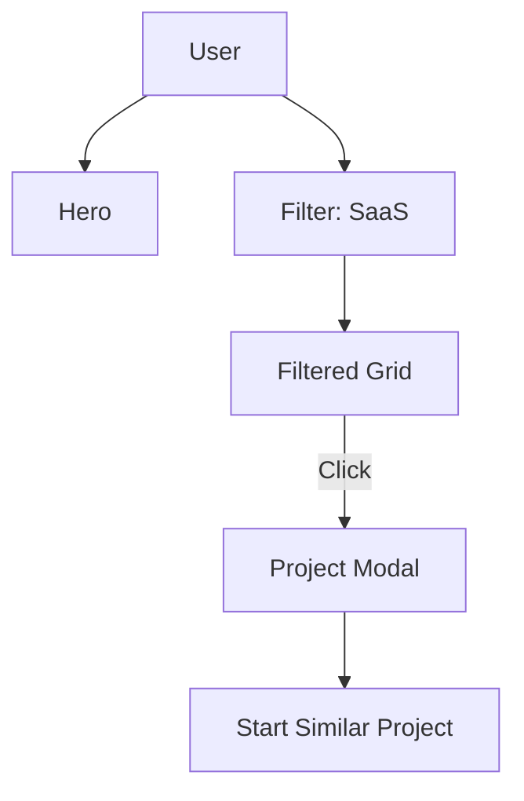

# Design Plan: Projects & Portfolio

**Page Type:** Portfolio / Case Studies
**Route:** `/projects`
**Design System:** Sun AI "Lux" (FashionOS Variant)
**Status:** Design Specification

---

## 1️⃣ Page Strategy & UX Intent

**Purpose:**
To provide irrefutable proof of competence. This page moves the conversation from "Can they do it?" to "Look what they did for *them*."

**Problem Solved:**
Buyers are skeptical of AI "vaporware." They need to see real, production-grade software that is generating revenue.

**User Decision:**
"This quality is exactly what I aspire to. I want a case study like this for my company."

**Luxury Analogy:**
**The Art Gallery Exhibition.** Clean white walls, focused spotlighting, minimal placards. The work (the software) stands alone as the art piece.

---

## 2️⃣ Information Architecture

1.  **Hero Carousel:** "The Masterpieces." 3 high-impact, full-width featured projects.
2.  **Metrics Bar:** "The Impact." Aggregated stats ($47M revenue, 50+ projects).
3.  **Filterable Grid:** "The Collection." 12+ projects sortable by Industry/Tech.
4.  **Detail Modal:** "The Deep Dive." Clicking a project opens a rich overlay (no page reload).
5.  **Testimonials:** "The Patrons." Client quotes linked to specific projects.
6.  **CTA:** "Build Your Masterpiece."

---

## 3️⃣ Scroll-Driven Storytelling Flow

*   **Scroll 0% (Hero):** *Desire.* A massive, beautiful interface screenshot rotates slowly. It looks expensive and polished.
*   **Scroll 20% (Metrics):** *Validation.* The "87x ROI" number anchors the visuals in business reality.
*   **Scroll 40% (The Grid):** *Discovery.* The user filters by "Real Estate" or "SaaS". They see specific relevance to their niche.
*   **Interaction (Click):** *Depth.* The modal opens. They read the "Challenge vs Solution" story.
*   **Scroll 100% (CTA):** *Aspiration.* "Start Your Project."

---

## 4️⃣ Wireframe Layout (Text-Based)

```text
[ HERO CAROUSEL ]
Full-width Image Background (Darkened)
Overlay Text: "TechNova: AI Chatbot Platform"
[ View Case Study ]
(Dots navigation)

[ METRICS STRIP ]
[ 50+ Projects ] [ $47M Revenue ] [ 95% On-Time ]
(Minimalist numbers, thin separators)

[ FILTER BAR ]
[ All ] [ SaaS ] [ E-Commerce ] [ Healthcare ] [ Finance ]
(Pill shaped toggle buttons)

[ PROJECT GRID (Masonry or 3-Col) ]
[ Card 1: Large Image ]
  [ Title + Tag ]
[ Card 2 ] [ Card 3 ]
[ Card 4 ] [ Card 5 ]
(Hover: Image scales, "View" button appears)

[ TESTIMONIAL SLIDER ]
"Quote..." - Client Name
(Linked Project Thumbnail)

[ CTA FOOTER ]
```

---

## 5️⃣ UI Layout & Visual System Rules

*   **Card Style:** Zero border radius on images (architectural look) OR super-rounded (40px) depending on the "Lux" variant. Let's stick to **Rounded (24px)** for friendliness.
*   **Hover States:** The card should feel "heavy" and tactile. On hover, slight lift, shadow deepens, and the "View Case Study" button fades in from the bottom.
*   **Tags:** Minimalist pills. `bg-slate-100 text-slate-600`.

---

## 6️⃣ Typography & Visual Hierarchy

*   **Project Titles:** Playfair Display.
*   **Metrics:** Inter Bold (gradient text).
*   **Descriptions:** Truncated to 2 lines maximum. Visuals take priority.

---

## 7️⃣ Responsive Design Best Practices

*   **Grid:**
    *   Desktop: 3 Columns.
    *   Tablet: 2 Columns.
    *   Mobile: 1 Column (cards stack).
*   **Filters:** On mobile, convert the pill row into a horizontal scroll container (no wrapping) or a dropdown.

---

## 8️⃣ Navigation, Routes & Links

*   **Primary CTA:** `/booking` (Start Project)
*   **Breadcrumbs:** Home > Projects

---

## 9️⃣ Diagrams & Visual Aids



---

## 🔟 Multi-Step DESIGN PROMPTS

### 1. Hero Carousel
> "Create a full-width Hero Carousel. Content: 3 Slides. Each slide features a high-fidelity dashboard screenshot on the left (60% width) and text on the right (40%). Text: 'TechNova Platform', 'SaaS', '40% Conversion Lift'. Background: Deep Void (#050508). Navigation: Minimalist arrows and progress bar."

### 2. Project Grid
> "Create a 3-column Grid. Cards are 'Image-First'. Aspect Ratio 4:3. Image takes up 80% of card. Bottom 20% is white space with 'Project Title' (Serif) and 'Industry Tag' (Sans). Hover effect: The image zooms (scale 1.05) and a glassmorphism button 'View Case Study' appears in the center."

### 3. Metrics Strip
> "Create a minimalist stat bar. Background: White. 4 Columns. Content: Icon (Emerald), Number (Large, Inter Bold), Label (Small, Uppercase). Separators: Thin vertical lines between columns. Animation: Count-up numbers when scrolled into view."

### 4. Detail Modal
> "Create a Full-Screen Modal overlay. Backdrop: Blur (10px) Dark. Modal Content: White Card. Layout: Left col is a scrollable image gallery. Right col is sticky text: 'Challenge', 'Solution', 'Results' (Bullet points with checkmarks), 'Tech Stack' (Logos). CTA at bottom right: 'Build Something Like This'."

---

## 1️⃣1️⃣ Performance & Accessibility

*   **Images:** Crucial. Use `Next/Image` with `placeholder="blur"`.
*   **Filters:** Ensure keyboard navigation works for the filter tabs (Tab + Enter to select).
*   **Modal:** Must trap focus when open and support `Esc` key to close.
