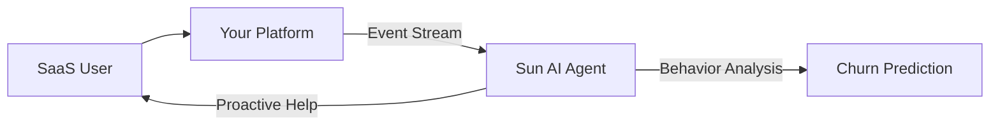

# Design Plan: AI for SaaS & Software Companies

**Industry:** SaaS (Software as a Service)
**Route:** `/industries/saas`
**Design System:** Sun AI "Lux" (Tech/Geometric Variant)
**Status:** Design Specification

---

## 1️⃣ Page Purpose & User Intent

**Who is this for?**
CTOs, Product Managers, and Founders of B2B SaaS platforms who are struggling with scaling support, onboarding users, or reducing churn.

**Problem Solved:**
SaaS companies hit a "margin wall" where hiring more support/sales staff kills profitability. They need automation to scale revenue without scaling headcount.

**User Decision:**
"Sun AI understands software architecture. They aren't just building chatbots; they are building intelligent layers into my product."

**Funnel Position:**
Mid-Funnel. The user likely knows they need AI but is deciding between building in-house vs. partnering.

---

## 2️⃣ Information Architecture (Section Order)

1.  **Hero Section:** "The Autonomous SaaS." Focus on infinite scale.
2.  **The "Churn Killer" Use Case:** Automated onboarding and retention flows.
3.  **Metrics Bar:** CAC reduction, LTV increase, Ticket deflection.
4.  **Capability Grid:** Feature flags, SQL generation, Support triage.
5.  **Integration Diagram:** How we sit between your DB (Postgres) and Front-end.
6.  **Security & Compliance:** SOC 2, GDPR focus (Crucial for SaaS).
7.  **Case Study:** "TechNova" (SaaS specific).
8.  **CTA:** "Scale Your Platform."

---

## 3️⃣ Scroll-Driven Storytelling Plan

*   **Scroll 0% (Hero):** *Scale.* Visuals of server racks or abstract nodes multiplying. Headline about "Zero Marginal Cost."
*   **Scroll 30% (Use Cases):** *Efficiency.* Watching a user get onboarded without a human. The "Aha!" moment of automation.
*   **Scroll 60% (Integration):** *Technical Trust.* Showing code snippets or API diagrams. Proving we speak their language.
*   **Scroll 90% (Security):** *Safety.* Compliance badges. reassuring the CTO.
*   **Scroll 100% (Action):** *Growth.* A confident call to build the next unicorn.

---

## 4️⃣ Wireframes (Low-Fidelity)

**Desktop:**
```text
[ HERO ]
Left: "Scale Support to Infinity"
Right: [ 3D Server/Node Visual ]

[ METRICS STRIP ]
[ -40% Churn ] [ +20% NRR ] [ 24/7 Uptime ]

[ SPLIT FEATURE: ONBOARDING ]
Left: Text "No More Manual Demos"
Right: UI Mockup of AI guiding a cursor

[ SPLIT FEATURE: RETENTION ]
Left: UI Mockup of AI predicting churn
Right: Text "Predictive Health Scores"

[ ARCHITECTURE DIAGRAM ]
[ Your App ] <--> [ Sun AI API ] <--> [ Your DB ]

[ COMPLIANCE LOGOS ]
SOC2 | HIPAA | GDPR

[ CTA ]
```

**Mobile:**
- Stack the Split Features (Image Top, Text Bottom).
- Architecture diagram becomes a vertical flow.

---

## 5️⃣ Section-by-Section Layout Strategy

*   **Hero:** Split layout. High contrast dark mode to appeal to devs/founders.
*   **Features:** Zig-zag layout (Left/Right alternating) to maintain interest. Large UI mockups.
*   **Architecture:** Centered, symmetrical diagram. Glassmorphism for the "Sun AI" layer to imply it's a lens/filter.
*   **Security:** Monochrome grid of logos. Very understated and professional.

---

## 6️⃣ Visual System Guidelines

*   **Palette:** Deep Void backgrounds with **Electric Blue** and **Neon Purple** accents (Cyber/Tech feel).
*   **Imagery:** High-fidelity dashboard screenshots, abstract 3D geometry (cubes, networks).
*   **Typography:** Monospace fonts (JetBrains Mono) for data points and code snippets. Playfair Display for emotional headlines.

---

## 7️⃣ Responsive Design Strategy

*   **Diagrams:** On mobile, complex flowcharts must simplify or become vertical lists.
*   **Screenshots:** Ensure text inside screenshots is legible or abstracted away into shapes on small screens.

---

## 8️⃣ Navigation, Routes & Links

*   **Route:** `/industries/saas`
*   **Primary CTA:** `/start` (Start Assessment)
*   **Secondary CTA:** `/projects` (See SaaS Case Studies)
*   **Footer:** Link to "AI Web Dev" service page.

---

## 9️⃣ Diagrams & Flowcharts



---

## 🔟 Multi-Step DESIGN PROMPTS

### 1. Hero Section
> "Create a SaaS Hero Section. Background: Deep Void (#050508). Headline: 'Scale Your SaaS Without Headcount' (Playfair, White). Visual: A 3D isometric view of a server stack transforming into a cloud of particles. Primary CTA: 'Automate Operations' (Electric Blue Button)."

### 2. Onboarding Flow Visual
> "Create a Split Section. Right side: A glassmorphism card resembling a SaaS dashboard. Overlaid is a 'Ghost Cursor' and a chat bubble saying 'Let me show you how to create your first project.' Left side: Typography explaining 'Autonomous Onboarding'."

### 3. Architecture Diagram
> "Create a centered Technical Diagram. Three layers stacked vertically. Bottom: 'Your Database' (Cylinder icon). Middle: 'Sun AI Neural Layer' (Glowing Brain/Network icon, pulsing). Top: 'User Experience' (UI Cards). Connectors are animated flowing lines."

### 4. ROI Cards
> "Create a grid of 3 Dark Cards. Card 1: '-40% Support Costs' (Bar chart icon). Card 2: '+25% Feature Adoption' (Trend up icon). Card 3: 'Zero Downtime' (Checkmark shield). Use a monospaced font for the numbers."

### 5. Final CTA
> "Create a full-width CTA section. Background: A subtle code-matrix rain effect (very low opacity). Centered card: 'Ready to modernize your stack?'. Button: 'Deploy Intelligence' (Gradient Purple-to-Blue)."
