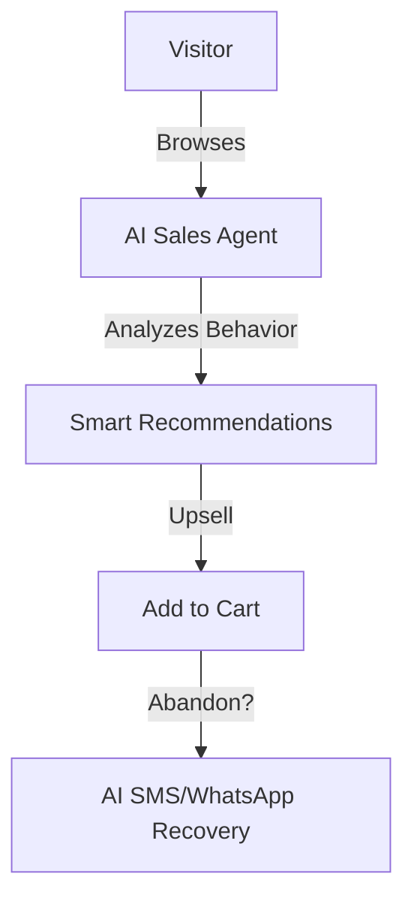

# Design Plan: AI for E-commerce & Retail

**Industry:** E-commerce & Retail
**Route:** `/industries/ecommerce`
**Design System:** Sun AI "Lux" (Retail/Fashion Variant)
**Status:** Design Specification

---

## 1️⃣ Page Purpose & User Intent

**Who is this for?**
DTC Founders, CMOs, and E-commerce Directors managing high-volume stores (Shopify Plus, Magento, Enterprise).

**Problem Solved:**
Ad costs are rising (CAC up), and conversion rates are stagnant. They need higher LTV and AOV without hiring more support staff.

**User Decision:**
"This isn't just a chatbot; it's a shopping assistant that actually sells."

**Funnel Position:**
Top/Mid-Funnel. They are looking for "Growth Hacks" or "AI Tools" to improve margins.

---

## 2️⃣ Information Architecture (Section Order)

1.  **Hero Section:** "The 24/7 Sales Associate."
2.  **Visual Demo:** Personalization engine in action (changing products based on user).
3.  **The "Abandoned Cart" Recovery:** AI vs Email comparison.
4.  **Support Automation:** Reducing "Where is my order?" (WISMO) tickets.
5.  **Inventory Intelligence:** Predicting stock outs.
6.  **Integrations:** Shopify, Klaviyo, Gorgias.
7.  **CTA:** "Audit My Store."

---

## 3️⃣ Scroll-Driven Storytelling Flow

*   **Scroll 0% (Hero):** *Desire.* Beautiful lifestyle imagery mixed with UI. High fashion feel.
*   **Scroll 30% (Personalization):** *Magic.* The user sees a product grid shuffle dynamically. "Show me summer dresses" -> Grid updates.
*   **Scroll 60% (Support):** *Relief.* A chaotic inbox transforming into organized, resolved tickets.
*   **Scroll 100% (Action):** *Revenue.* A focus on ROI and sales lift.

---

## 4️⃣ Wireframes (Low-Fidelity)

**Desktop:**
```text
[ HERO ]
Full-screen Lifestyle Image (Model holding phone)
Overlay Text: "Turn Visitors Into Super-Fans"
CTA: "Boost AOV"

[ DYNAMIC PRODUCT GRID ]
[ Phone Frame ] showing chat: "I need a gift for mom."
[ Product Cards ] slide in from right matching the request.

[ ROI STATS ]
[ +30% AOV ] [ -70% Support Costs ] [ 24/7 Sales ]

[ INTEGRATION ROW ]
Shopify | WooCommerce | Klaviyo | Gorgias

[ TESTIMONIAL ]
"Our AOV jumped $12 overnight." - Fashion Brand CEO

[ CTA ]
```

---

## 5️⃣ Section-by-Section Layout Strategy

*   **Hero:** Full-bleed image background with glassmorphism overlay for text. Very "Vogue" aesthetic.
*   **Product Grid:** Masonry layout. Images are high-quality product shots.
*   **Stats:** Large serif numbers. Elegant, thin lines separating them.
*   **Integrations:** Grayscale logos that turn color (Brand colors) on hover.

---

## 6️⃣ Visual System Guidelines

*   **Palette:** **Soft Cream** (#FDFBF7), **Charcoal** (#1A1A1A), and **Gold** (#D4AF37) accents.
*   **Imagery:** High-end photography. Fashion, lifestyle, clean product shots.
*   **Typography:** Playfair Display (Italicized for emphasis).

---

## 7️⃣ Responsive Design Strategy

*   **Hero:** On mobile, ensure the text overlay has a solid blur background so it's readable over the image.
*   **Product Grid:** 1 column carousel (swipeable) on mobile to save vertical space.

---

## 8️⃣ Navigation, Routes & Links

*   **Route:** `/industries/ecommerce`
*   **Primary CTA:** `/start`
*   **Secondary CTA:** `/services/ai-chatbots`
*   **Footer:** Link to "Sales & Marketing AI" service.

---

## 9️⃣ Diagrams & Flowcharts



---

## 🔟 Multi-Step DESIGN PROMPTS

### 1. Hero Section
> "Create an E-commerce Hero. Background: A high-fashion editorial shot (darkened slightly). Center Overlay: Glassmorphism card. Headline: 'The 24/7 AI Sales Associate' (Playfair Italic). Subhead: 'Personalize every visit. Recover every cart.' CTA: 'Start Selling Smarter' (Gold Button)."

### 2. Personalization Visual
> "Create an interactive visual section. Left: A mobile chat interface showing 'I'm looking for red sneakers.' Right: A grid of 3 sneaker cards that 'floats' into view. The cards have 'Match 98%' badges in Gold."

### 3. Comparison Section (Recovery)
> "Create a 'Before & After' comparison. Left (Old Way): A generic email template icon (Gray). Right (Sun AI): A WhatsApp message notification on a lock screen saying 'Hey Sarah, your size 8 dress is low stock!' (Green/Gold). Heading: 'Don't Spam. Converse.'"

### 4. Integration Logo Strip
> "Create a minimalist logo strip. White background. Logos for Shopify, Magento, Klaviyo, Gorgias. Opacity 50%. Hover effect: Logos scale 1.1x and turn full color."

### 5. Final CTA
> "Create a centered CTA on a Cream background. Headline: 'Ready to increase AOV?'. Subhead: 'Join 50+ brands using Sun AI.' Button: 'Get Your Audit' (Black button, White text)."
