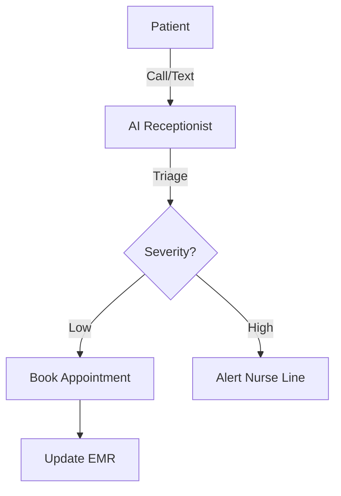

# Design Plan: AI for Healthcare & Clinics

**Industry:** Healthcare
**Route:** `/industries/healthcare`
**Design System:** Sun AI "Lux" (Clinical/Clean Variant)
**Status:** Design Specification

---

## 1️⃣ Page Purpose & User Intent

**Who is this for?**
Clinic Owners, Hospital Administrators, and HealthTech Founders.

**Problem Solved:**
Administrative burnout. Doctors/Nurses spend too much time on paperwork, scheduling, and basic triage. Patient experience suffers.

**User Decision:**
"This is HIPAA compliant, safe, and will actually give my staff their time back."

**Funnel Position:**
High Trust / Consideration. Safety is the #1 objection.

---

## 2️⃣ Information Architecture (Section Order)

1.  **Hero Section:** "Care First, Admin Last."
2.  **Trust & Compliance:** HIPAA, SOC 2, Encryption (Front and center).
3.  **Use Case: Patient Triage:** AI handling initial symptom intake.
4.  **Use Case: Scheduling:** 24/7 Appointment booking via Voice/SMS.
5.  **Use Case: Documentation:** Scribe/Notes automation.
6.  **Security Detail:** Deep dive into data handling.
7.  **CTA:** "Secure Consultation."

---

## 3️⃣ Scroll-Driven Storytelling Flow

*   **Scroll 0% (Hero):** *Calm.* Clean whites and soft blues. A feeling of sterility and order.
*   **Scroll 20% (Compliance):** *Safety.* Immediate reassurance. "We are safe."
*   **Scroll 50% (Use Cases):** *Efficiency.* Showing a doctor talking to a patient while AI takes notes.
*   **Scroll 100% (Action):** *Partnership.* "Let's modernize your practice."

---

## 4️⃣ Wireframes (Low-Fidelity)

**Desktop:**
```text
[ HERO ]
Headline: "Focus on Patients, Not Paperwork"
Image: Doctor smiling, holding tablet.
Badge: HIPAA Compliant

[ TRUST BAR ]
HIPAA | SOC 2 | GDPR | HITECH

[ FEATURE 1: TRIAGE ]
[ Chat Interface ] "My head hurts..." -> "How long?"
Text: "Automated Intake & Risk Assessment"

[ FEATURE 2: SCHEDULING ]
[ Calendar UI ] Auto-filling slots.
Text: "24/7 Booking Concierge"

[ DOCUMENTATION VISUAL ]
Audio Waveform -> Text Document
Text: "Ambient Clinical Scribing"

[ CTA ]
```

---

## 5️⃣ Section-by-Section Layout Strategy

*   **Hero:** Split layout. High-quality photography of care providers.
*   **Trust Bar:** Fixed strip below hero. Cannot be missed.
*   **Features:** Clean cards with ample whitespace. Icons are thin, medical-style strokes.
*   **Colors:** **Teal** (#008080), **White**, and **Soft Grey**. No jarring colors (like Red or Orange).

---

## 6️⃣ Visual System Guidelines

*   **Mood:** Sterile, Professional, Empathetic, Calm.
*   **Shapes:** Rounded corners (Softness). Circles (Organic).
*   **Imagery:** People-focused. Patients looking relieved, Doctors looking focused (not stressed).

---

## 7️⃣ Responsive Design Strategy

*   **Trust Bar:** On mobile, use a 2x2 grid for the compliance logos.
*   **Chat Triage:** Ensure the chat text is large enough to read on mobile, as this is the primary demo.

---

## 8️⃣ Navigation, Routes & Links

*   **Route:** `/industries/healthcare`
*   **Primary CTA:** `/contact` (Book Strategy Call)
*   **Footer:** Link to "Privacy Policy" (Crucial for this sector).

---

## 9️⃣ Diagrams & Flowcharts



---

## 🔟 Multi-Step DESIGN PROMPTS

### 1. Hero Section
> "Create a Healthcare Hero. Background: Very soft Teal/White gradient. Headline: 'Care First. Admin Last.' (Serif). Subhead: 'Automate intake, scheduling, and documentation with HIPAA-compliant AI.' Badge: 'HIPAA Ready' shield icon. CTA: 'Modernize My Practice'."

### 2. Compliance Strip
> "Create a Trust Strip. Background: White. Logos: HIPAA, HITECH, SOC 2, AES-256. Style: Clean, monochromatic (Teal or Grey). Spaced evenly."

### 3. Triage Feature
> "Create a Feature Section. Left: Text 'Intelligent Patient Triage'. Right: A mobile phone mockup showing a chat interface. 'Bot: Do you have a fever?', 'Patient: Yes, slightly.', 'Bot: Okay, booking you for a tele-health visit.' Use calming colors for the bubbles."

### 4. Scribe Visual
> "Create a visual for 'Ambient Scribing'. Left: An animated audio waveform (recording). Arrow pointing right. Right: A structured medical note (Subjective, Objective, Assessment, Plan) appearing line-by-line. Background: Glassmorphism card."

### 5. Final CTA
> "Create a Footer CTA. Background: Deep Teal. Text: White. 'Ready to reduce burnout?'. Button: 'Schedule Discovery Call' (White button, Teal text)."
