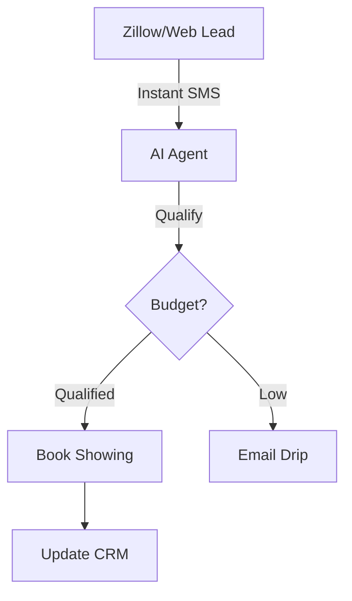

# Design Plan: AI for Real Estate

**Industry:** Real Estate
**Route:** `/industries/real-estate`
**Design System:** Sun AI "Lux" (Architectural/Spatial Variant)
**Status:** Design Specification

---

## 1️⃣ Page Purpose & User Intent

**Who is this for?**
Brokerage Owners, Top-Producing Agents, and Property Management Firms.

**Problem Solved:**
Speed to lead. Real estate leads go cold in 5 minutes. Agents hate answering "Is this still available?" 50 times a day.

**User Decision:**
"I need a system that answers leads instantly and schedules showings so I can focus on closing."

**Funnel Position:**
Mid-Funnel. They know they need automation but fear "robotic" interactions turning off high-end clients.

---

## 2️⃣ Information Architecture (Section Order)

1.  **Hero Section:** "The 24/7 Agent."
2.  **Visual Demo:** Virtual Tour / Image Analysis.
3.  **Lead Qualification:** Chatbot filtering "Lookie-loos" from "Buyers."
4.  **Property Matching:** AI matching leads to listings.
5.  **Market Analysis:** Automated valuation and trend reports.
6.  **Results:** Deal flow increase.
7.  **CTA:** "Automate Your Brokerage."

---

## 3️⃣ Scroll-Driven Storytelling Flow

*   **Scroll 0% (Hero):** *Aspiration.* Beautiful architectural photography. The promise of "Selling in your sleep."
*   **Scroll 30% (Lead Qual):** *Utility.* Seeing a text conversation where a lead gets booked for a viewing automatically.
*   **Scroll 60% (Matching):** *Intelligence.* A map view showing matching properties.
*   **Scroll 100% (Action):** *Dominance.* "Capture every lead."

---

## 4️⃣ Wireframes (Low-Fidelity)

**Desktop:**
```text
[ HERO ]
Full-width Architectural Photo (Modern Home)
Overlay: "Never Miss a Lead Again"
CTA: "See the Demo"

[ SMS CONVERSATION MOCKUP ]
Left: Lead asks "Price?"
Right: AI answers & books showing.

[ PROPERTY CARD GRID ]
[ House 1 ] [ House 2 ] [ House 3 ]
Overlay: "AI Matched Score: 98%"

[ MAP VISUALIZATION ]
Pins dropping on a map based on lead preferences.

[ TESTIMONIAL ]
"We doubled our showing volume." - Agency Owner

[ CTA ]
```

---

## 5️⃣ Section-by-Section Layout Strategy

*   **Hero:** Immersive, full-screen image. Text needs strong drop shadows or a dark scrim.
*   **SMS Demo:** Split layout. iPhone mockup is key here.
*   **Property Grid:** standard 3-column card layout, but with "AI Badges" (e.g., "High Yield", "Perfect Match").
*   **Colors:** **Navy** (#000080), **Gold**, and **White**. Classic luxury real estate colors.

---

## 6️⃣ Visual System Guidelines

*   **Typography:** Playfair Display (Headlines) + elegant Sans Serif.
*   **Lines:** Thin, precise lines (Blueprint aesthetic).
*   **Imagery:** High-dynamic-range (HDR) property photos.

---

## 7️⃣ Responsive Design Strategy

*   **Hero:** Mobile needs to crop the architectural photo carefully (center focus).
*   **SMS Demo:** Vertical stack. Ensure the text bubbles are legible.

---

## 8️⃣ Navigation, Routes & Links

*   **Route:** `/industries/real-estate`
*   **Primary CTA:** `/start`
*   **Secondary CTA:** `/services/ai-chatbots` (Chatbots are huge here).

---

## 9️⃣ Diagrams & Flowcharts



---

## 🔟 Multi-Step DESIGN PROMPTS

### 1. Hero Section
> "Create a Real Estate Hero. Background: Stunning modern villa at dusk. Headline: 'The 24/7 Agent That Never Sleeps.' Subhead: 'Instantly qualify leads, schedule showings, and close more deals.' CTA: 'Automate My Leads' (Gold Button)."

### 2. SMS Qualification Demo
> "Create a Visual Section. Center: Floating iPhone Mockup. Screen: iMessage interface. 'Lead: Can I see 123 Main St?', 'AI: Sure! I have openings at 2pm or 4pm today. Which works?', 'Lead: 4pm.', 'AI: You are confirmed.' Add a subtle 'Typing...' animation."

### 3. Blueprint Matching Feature
> "Create a Feature Section. Background: subtle blueprint pattern (white lines on blue). Foreground: A glass card showing a Property Photo with a '98% Match' badge overlaid. Text: 'Intelligent Property Matching'."

### 4. Map Visualization
> "Create a Map Section. A stylized map (Google Maps style but darker theme). Animate location pins dropping one by one. Text: 'Hyper-local Market Intelligence'."

### 5. Final CTA
> "Create a Footer CTA. Background: Navy Blue. Headline: 'Stop Losing Leads to Speed.' Button: 'Deploy Your AI Agent' (White/Gold)."
