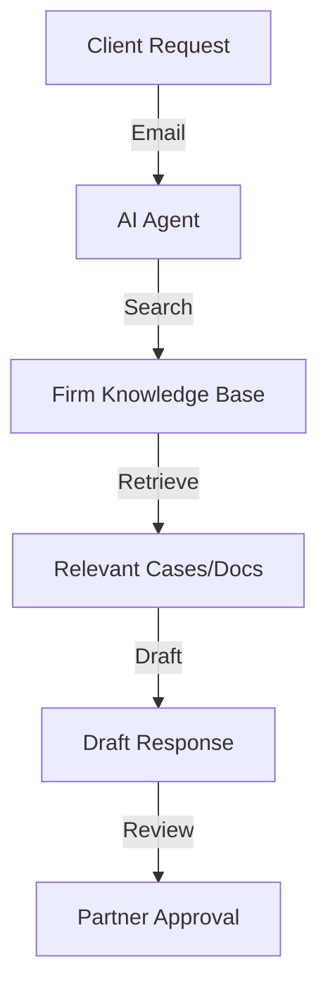

# Design Plan: AI for B2B & Professional Services

**Industry:** B2B Services (Consulting, Legal, Finance, Agencies)
**Route:** `/industries/b2b-services`
**Design System:** Sun AI "Lux" (Corporate/Executive Variant)
**Status:** Design Specification

---

## 1️⃣ Page Purpose & User Intent

**Who is this for?**
Partners at Law Firms, Agency Owners, Financial Advisors, Consultants.

**Problem Solved:**
Time-for-money trap. High-paid professionals wasting hours on research, document review, and proposal writing.

**User Decision:**
"This gives me 'Infinite Interns'. I can scale my output without burning out my senior staff."

**Funnel Position:**
Mid-Funnel. Looking for efficiency and leverage.

---

## 2️⃣ Information Architecture (Section Order)

1.  **Hero Section:** "The Automated Firm."
2.  **Document Intelligence:** Contract review/analysis demo.
3.  **Proposal Generation:** Auto-drafting RFPs/SOWs.
4.  **Client Reporting:** Automated weekly reports.
5.  **Knowledge Base:** "Chat with your Firm's Brain."
6.  **Security:** Data privacy (Crucial for legal/finance).
7.  **CTA:** "Scale Your Expertise."

---

## 3️⃣ Scroll-Driven Storytelling Flow

*   **Scroll 0% (Hero):** *Authority.* High-rise office aesthetic. Seriousness.
*   **Scroll 30% (Documents):** *Speed.* A 50-page PDF being summarized in seconds.
*   **Scroll 60% (Knowledge):** *Leverage.* Accessing 10 years of case files instantly.
*   **Scroll 100% (Action):** *Evolution.* Moving from manual to AI-assisted.

---

## 4️⃣ Wireframes (Low-Fidelity)

**Desktop:**
```text
[ HERO ]
Headline: "Scale Your Expertise, Not Your Hours"
Visual: Abstract Document Flow / Network
CTA: "Analyze My Workflow"

[ DOCUMENT DEMO ]
Left: PDF Icon (Contract) -> Arrow -> Right: Summary Card
Text: "Instant Contract Analysis"

[ PROPOSAL GENERATOR ]
UI Mockup: "Draft SOW for Client X" -> Text generates.

[ KNOWLEDGE GRAPH ]
Visual: Nodes connecting (People, Projects, Docs)
Text: "Your Institutional Memory, Unlock."

[ TRUST LOGOS ]
Corporate client logos.

[ CTA ]
```

---

## 5️⃣ Section-by-Section Layout Strategy

*   **Hero:** Split or Center. Dark, serious tones.
*   **Demo Sections:** Horizontal flows (Left to Right) showing Input -> AI Processing -> Output.
*   **Colors:** **Charcoal**, **Slate Blue**, **Silver**. Very "Boardroom".

---

## 6️⃣ Visual System Guidelines

*   **Typography:** Serif headlines (Times New Roman-esque but modern, e.g., Playfair or Merriweather). Sans body.
*   **Imagery:** Abstract representations of documents, networks, and data. Avoid stock photos of "people shaking hands."

---

## 7️⃣ Responsive Design Strategy

*   **Document Flow:** On mobile, stack the Input -> Output vertically. Use a "Down Arrow" instead of "Right Arrow".

---

## 8️⃣ Navigation, Routes & Links

*   **Route:** `/industries/b2b-services`
*   **Primary CTA:** `/start`
*   **Secondary CTA:** `/services/ai-agents`

---

## 9️⃣ Diagrams & Flowcharts



---

## 🔟 Multi-Step DESIGN PROMPTS

### 1. Hero Section
> "Create a B2B Hero. Background: Slate Grey/Black gradient. Headline: 'Scale Your Expertise. Automate the Rest.' (Serif). Visual: Abstract lines connecting document icons into a network. CTA: 'Consult with Sun AI'."

### 2. Document Analysis Visual
> "Create a Process Visual. Left: A stack of papers icon labeled '50-Page Contract'. Center: A pulsing AI orb. Right: A clean card labeled 'Executive Summary' with bullet points. Connect them with a flowing animated line."

### 3. Knowledge Base Search
> "Create a Search Interface Mockup. Search Bar: 'What is our stance on IP Indemnification?'. Result Card: 'Based on 12 past contracts, we typically use...'. Highlight specific text in the result."

### 4. Security Badge Section
> "Create a Security Row. Background: Silver/Light Grey. Text: 'Enterprise-Grade Confidentiality.' Icons: 'Zero-Retention Mode', 'On-Premise Deployment', 'Audit Logs'."

### 5. Final CTA
> "Create a Footer CTA. Minimalist. White background. Headline: 'The Future of Professional Services.' Button: 'Start Transformation' (Black button)."
