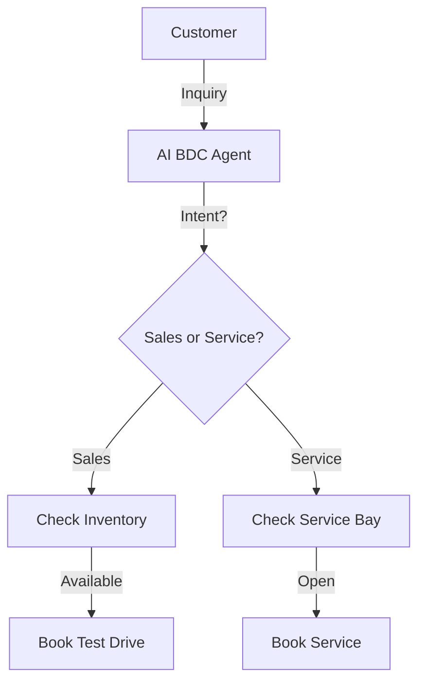

# Design Plan: AI for Automotive & Dealerships

**Industry:** Automotive
**Route:** `/industries/automotive`
**Design System:** Sun AI "Lux" (Sleek/Performance Variant)
**Status:** Design Specification

---

## 1️⃣ Page Purpose & User Intent

**Who is this for?**
Dealership General Managers, Auto Group Marketing Directors.

**Problem Solved:**
Phone tag. Service appointment no-shows. Leads falling through the cracks after hours.

**User Decision:**
"This will fill my service bays and get more people into test drives without my BDC burning out."

**Funnel Position:**
Mid/Bottom Funnel. Performance driven.

---

## 2️⃣ Information Architecture (Section Order)

1.  **Hero Section:** "The 24/7 BDC." (Business Development Center).
2.  **Test Drive Booking:** Automated SMS scheduling.
3.  **Service Lane AI:** Booking oil changes/repairs automatically.
4.  **Inventory Assistant:** "Do you have a white X5?" -> "Yes, here is the VDP."
5.  **Reactivation:** Texting past customers for trade-ins.
6.  **ROI Stats:** Appointment show rates.
7.  **CTA:** "Drive More Sales."

---

## 3️⃣ Scroll-Driven Storytelling Flow

*   **Scroll 0% (Hero):** *Speed.* Sleek car imagery. Fast motion.
*   **Scroll 30% (Booking):** *Action.* Seeing a test drive booked in 30 seconds via text.
*   **Scroll 60% (Inventory):** *Discovery.* Browsing cars via chat.
*   **Scroll 100% (Action):** *Results.* "Fill your calendar."

---

## 4️⃣ Wireframes (Low-Fidelity)

**Desktop:**
```text
[ HERO ]
Video Background (Cars moving fast/Showroom)
Headline: "Your 24/7 AI Sales Team"
CTA: "Book a Demo"

[ SMS BOOKING DEMO ]
Split Screen:
Left: "I want to drive the 2024 Model Y."
Right: "Great, I have a slot at 2pm."

[ INVENTORY CAROUSEL ]
Cards of cars being 'served' by the AI.

[ SERVICE LANE STATS ]
[ +40% Service Appts ] [ -20% No Shows ]

[ CTA ]
```

---

## 5️⃣ Section-by-Section Layout Strategy

*   **Hero:** Video background is highly recommended here. High energy.
*   **Booking Demo:** Mobile-first layout (Phone mockup).
*   **Inventory:** Horizontal carousel.
*   **Colors:** **Metallic Silver**, **Red** (Call to action), **Carbon Fiber** (Texture).

---

## 6️⃣ Visual System Guidelines

*   **Typography:** Strong Sans Serif (Eurostile or similar) headers. Fast, bold.
*   **Imagery:** Studio car shots. High contrast. Reflections.

---

## 7️⃣ Responsive Design Strategy

*   **Hero Video:** Ensure it auto-plays muted on mobile (or fallback to image).
*   **Car Carousel:** Swipeable on mobile.

---

## 8️⃣ Navigation, Routes & Links

*   **Route:** `/industries/automotive`
*   **Primary CTA:** `/start`
*   **Footer:** Link to "Chatbots".

---

## 9️⃣ Diagrams & Flowcharts



---

## 🔟 Multi-Step DESIGN PROMPTS

### 1. Hero Section
> "Create an Auto Hero. Background: Dark showroom with a sleek silhouette of a luxury car. Headline: 'Accelerate Your Dealership.' (Bold Sans). Subhead: 'Automate test drives, service appointments, and trade-in valuations.' CTA: 'Start Your Engine' (Red Button)."

### 2. SMS Booking Visual
> "Create a Demo Section. Center: Phone Mockup. Screen: Text conversation. 'User: I need an oil change.' 'AI: Sure, I see you drive a 2021 F-150. Is Tuesday at 9am good?' 'User: Yes.' 'AI: Confirmed.' Background: Blurred garage/service lane."

### 3. Inventory Search Card
> "Create a Feature Card. Image: A white SUV. Overlay: 'In Stock - 3 Units'. Bottom: Chat input 'Do you have this in Black?'. Response: 'Yes, 1 arriving tomorrow.'."

### 4. ROI Dashboard
> "Create a Stats Row. Dark Carbon texture background. Numbers: Neon Red. '3.5x More Leads', '90% Response Rate', '24/7 Coverage'."

### 5. Final CTA
> "Create a Footer CTA. Background: White. Text: Black. Headline: 'Stop Losing Leads After 6pm.' Button: 'Activate AI BDC'."
