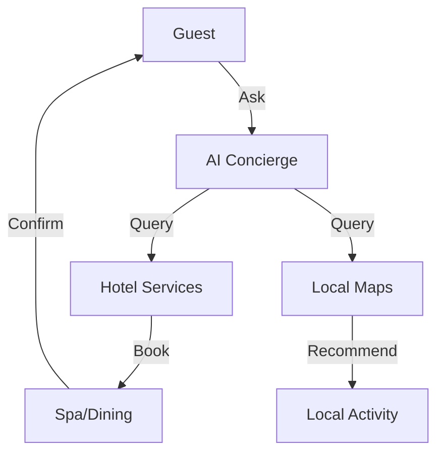

# Design Plan: AI for Tourism & Hospitality

**Industry:** Tourism (Hotels, Agencies, DMOs)
**Route:** `/industries/tourism`
**Design System:** Sun AI "Lux" (Travel/Experiential Variant)
**Status:** Design Specification

---

## 1️⃣ Page Purpose & User Intent

**Who is this for?**
Hotel GMs, Travel Agency Owners, Tourism Board Directors.

**Problem Solved:**
Guests expect instant answers 24/7 ("Is the pool open?", "Book me a table"). Staff is overwhelmed.

**User Decision:**
"This AI can handle the repetitive questions so my concierge can focus on VIPs."

**Funnel Position:**
Top/Mid Funnel. Experience driven.

---

## 2️⃣ Information Architecture (Section Order)

1.  **Hero Section:** "The 5-Star Digital Concierge."
2.  **Itinerary Generation:** Creating custom trips in seconds.
3.  **Booking Automation:** Hotels, Flights, Dining.
4.  **Local Guide:** "Best sushi near me?" (Maps Integration).
5.  **Multi-Language:** Speaking to guests in their native tongue.
6.  **Case Study:** Boutique Hotel / Agency.
7.  **CTA:** "Upgrade Your Guest Experience."

---

## 3️⃣ Scroll-Driven Storytelling Flow

*   **Scroll 0% (Hero):** *Escape.* Wanderlust imagery. Ocean, mountains, luxury lobbies.
*   **Scroll 30% (Itinerary):** *Magic.* Watching a 7-day trip to Italy being generated instantly.
*   **Scroll 60% (Language):** *Connection.* Seeing the bot switch from English to Spanish to Japanese.
*   **Scroll 100% (Action):** *Hospitality.* "Welcome your guests."

---

## 4️⃣ Wireframes (Low-Fidelity)

**Desktop:**
```text
[ HERO ]
Full-screen Video (Resort/Travel)
Headline: "The Concierge That Never Sleeps"
CTA: "See It In Action"

[ ITINERARY MAKER ]
Input: "3 days in Paris, art focus."
Output: [ Day 1 Card ] [ Day 2 Card ] [ Day 3 Card ]

[ BOOKING WIDGET ]
Chat: "Book a table for 2 at 8pm."
Result: "Confirmed at Le Jules Verne."

[ LANGUAGE GLOBE ]
Interactive Globe. Hover for languages.
"Fluent in 50+ Languages"

[ CTA ]
```

---

## 5️⃣ Section-by-Section Layout Strategy

*   **Hero:** Cinematic video background is essential.
*   **Itinerary:** Horizontal scroll cards (like a timeline).
*   **Colors:** **Sky Blue**, **Sand**, **Sunset Orange**. Warm, inviting, vacation vibes.

---

## 6️⃣ Visual System Guidelines

*   **Typography:** Elegant Serif (Modern). High contrast.
*   **Imagery:** High-saturation travel photography. Instagram-worthy.

---

## 7️⃣ Responsive Design Strategy

*   **Itinerary:** Vertical stack of cards on mobile.
*   **Booking:** Chat interface takes full screen focus on mobile.

---

## 8️⃣ Navigation, Routes & Links

*   **Route:** `/industries/tourism`
*   **Primary CTA:** `/start`
*   **Secondary CTA:** `/services/ai-agents`

---

## 9️⃣ Diagrams & Flowcharts



---

## 🔟 Multi-Step DESIGN PROMPTS

### 1. Hero Section
> "Create a Travel Hero. Background: Video loop of a luxury resort infinity pool at sunset. Headline: 'The 5-Star Digital Concierge.' (Elegant Serif, White). Subhead: 'Instant answers, itinerary planning, and booking for modern travelers.' CTA: 'Upgrade Guest Experience' (White/Sand button)."

### 2. Itinerary Generator Visual
> "Create an Itinerary Section. Left: Input field 'Plan a weekend in Tokyo'. Right: A timeline of cards appearing. '9am: Tsukiji Market', '1pm: TeamLabs', '7pm: Omakase'. Cards feature vibrant photos."

### 3. Multi-Language Demo
> "Create a Language Section. Center: A globe illustration. Around it, chat bubbles popping up in French, Spanish, Japanese, German. Text: 'Fluent in 50+ Languages instantly.'."

### 4. Local Guide Map
> "Create a Map Section. Style: Vacation/Resort map (Illustrated). Pins dropping for 'Best Coffee', 'Hidden Beach', 'Live Music'. Phone mockup showing the AI recommending these spots."

### 5. Final CTA
> "Create a Footer CTA. Background: Deep Ocean Blue. Headline: 'Give Your Guests the VIP Treatment.' Button: 'Deploy Concierge' (Gold text)."
