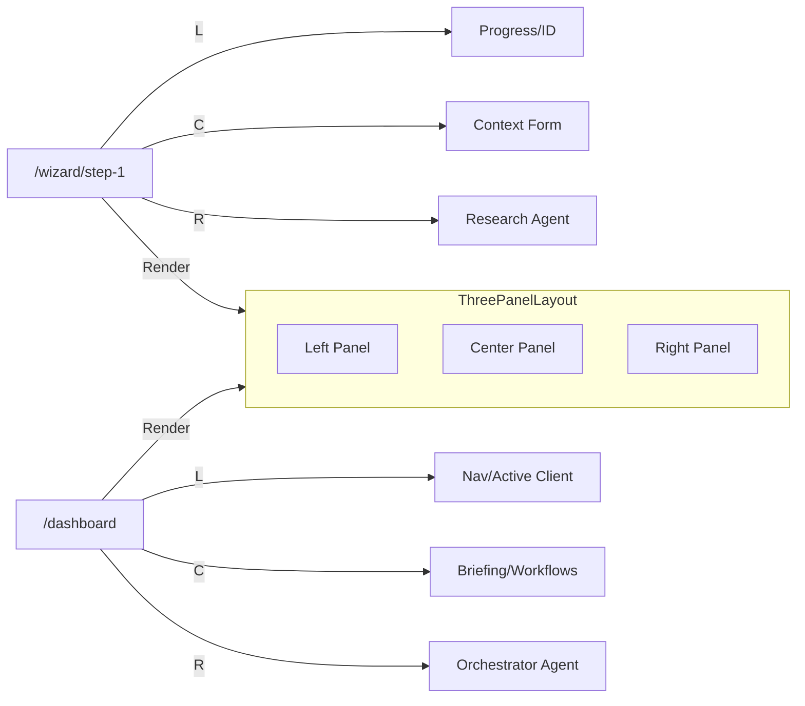

# Site Map & Routing Analysis

## 1. Short Summary
The application uses **React Router v6** (`react-router-dom` via `HashRouter`) for client-side navigation. The core architectural pattern is a **Persistent 3-Panel Layout** (`ThreePanelLayout`) used across all major routes.
- **Routing Strategy**: Hash-based (`/#/route`).
- **Entry Logic**: The root path `/` currently **redirects** immediately to the Onboarding Wizard (`/wizard/step-1`).
- **App Shell**: Wrapped in a global `AppProvider` context and an `ErrorBoundary`.
- **Navigation**: Linear progression in the Wizard; Tab/State-based navigation within the Dashboard.

---

## 2. Sitemap Tree

### A. Application Routes (Functional)
- `/` (Redirect -> `/wizard/step-1`)
- `/wizard`
  - `/wizard/step-1` (Entry Point - Business Context)
  - `/wizard/step-2` (Protected - Industry Deep Dive)
  - `/wizard/step-3` (Protected - System Selection)
  - `/wizard/step-4` (Protected - Readiness Score)
  - `/wizard/step-5` (Protected - Strategy Generation)
- `/dashboard` (Command Center - Protected)
  - *Internal Views:* Briefing, Strategy, Workflows, Reports, Settings
- `/client-dashboard` (External View - Mock Data)
  - *Internal Views:* Overview, Roadmap, Deliverables, Reports

### B. Marketing (Public)
*No public marketing pages are currently implemented in the code.*
The root path is currently consumed by the application redirect.

---

## 3. Mermaid Diagrams

### A. Sitemap Tree
```mermaid
graph TD
    Root[/] -->|Redirect| W1[Wizard Step 1]
    
    subgraph Onboarding [Wizard Flow]
        W1 -->|Next| W2[Step 2: Deep Dive]
        W2 -->|Next| W3[Step 3: Systems]
        W3 -->|Next| W4[Step 4: Readiness]
        W4 -->|Next| W5[Step 5: Strategy]
    end

    subgraph CoreApp [App Dashboard]
        W5 -->|Finish| Dash[Dashboard]
    end

    subgraph Client [Client View]
        CD[Client Dashboard]
    end

    W2 & W3 & W4 & W5 & Dash -.->|Protected by| Guard[RouteGuard]
```

### B. Route Grouping

```mermaid
block-beta
    columns 3
    block:Public
        W1["/wizard/step-1"]
        CD["/client-dashboard"]
    end
    block:Protected
        W2["/wizard/step-2"]
        W3["/wizard/step-3"]
        W4["/wizard/step-4"]
        W5["/wizard/step-5"]
        D["/dashboard"]
    end
    block:Redirects
        R["/ -> /wizard/step-1"]
    end
```


### C. Panel Layout Mapping
All routes utilize the `ThreePanelLayout`.



---

## 4. Routing Table

| Route | Screen Name | Component | Guard | Layout | Notes |
| :--- | :--- | :--- | :--- | :--- | :--- |
| `/` | Root | `<Navigate />` | No | None | Redirects to `/wizard/step-1` |
| `/wizard/step-1` | Business Context | `WizardStep1` | No | 3-Panel | Entry point; establishes global context. |
| `/wizard/step-2` | Deep Dive | `WizardStep2` | **Yes** | 3-Panel | Requires context to be set. |
| `/wizard/step-3` | System Selection | `WizardStep3` | **Yes** | 3-Panel | |
| `/wizard/step-4` | Readiness | `WizardStep4` | **Yes** | 3-Panel | Calculates score on mount. |
| `/wizard/step-5` | Strategy | `WizardStep5` | **Yes** | 3-Panel | Generates strategy on mount. |
| `/dashboard` | Command Center | `Dashboard` | **Yes** | 3-Panel | Contains internal state routing (`currentView`). |
| `/client-dashboard` | Client View | `ClientDashboard` | No | 3-Panel | Uses mock data; no auth required currently. |

---

## 5. Import Path Map

**Entry Point:** `index.tsx`
**Router Definition:** `App.tsx`

| Component Name | Import Path | Used By |
| :--- | :--- | :--- |
| `WizardStep1` | `./features/wizard/WizardStep1` | `App.tsx` |
| `WizardStep2` | `./features/wizard/WizardStep2` | `App.tsx` |
| `WizardStep3` | `./features/wizard/WizardStep3` | `App.tsx` |
| `WizardStep4` | `./features/wizard/WizardStep4` | `App.tsx` |
| `WizardStep5` | `./features/wizard/WizardStep5` | `App.tsx` |
| `Dashboard` | `./features/dashboard/Dashboard` | `App.tsx` |
| `ClientDashboard` | `./features/client-dashboard/ClientDashboard` | `App.tsx` |
| `RouteGuard` | `./components/RouteGuard` | `App.tsx` |
| `GlobalChat` | `./components/GlobalChat` | `App.tsx` |
| `ThreePanelLayout` | `./components/Layout` (via re-export) | All Feature Screens |

---

## 6. Where to Add Marketing Pages

To implement the "Sun AI" Home Page described in documentation without breaking the existing app:

**1. Create Directory Structure:**
```text
features/website/
  ├── HomePage.tsx
  ├── components/
  │   ├── Hero.tsx
  │   ├── ServiceGrid.tsx
  │   └── ...
```

**2. Update Routing Strategy (`App.tsx`):**
The current redirect at `/` prevents a landing page.
- **Change:** Remove `<Route path="/" element={<Navigate to="/wizard/step-1" replace />} />`
- **Add:** `<Route path="/" element={<HomePage />} />`
- **Add:** `<Route path="/start" element={<WizardStep1 />} />` (Optional alias for direct access)

**3. Connection:**
- The `HomePage` CTA ("Start Assessment") should link to `/wizard/step-1`.
- The `ThreePanelLayout` remains exclusive to the App routes (`/wizard/*`, `/dashboard`). The Marketing pages should likely use a different layout (e.g., `MarketingLayout` or just a simple page structure).

---

## 7. Gaps & Observations
1.  **Missing Home Page**: The documentation (`docs/website/01-home.md`) describes a "Lux" edition Home Page, but it does not exist in the codebase.
2.  **Redirect Loop Risk**: `RouteGuard` redirects to `/wizard/step-1` if context is missing. If the Home Page is added but `RouteGuard` logic isn't adjusted, users might get bounced unexpectedly if not careful with route definitions.
3.  **Client Dashboard Route**: `/client-dashboard` is currently unprotected and accessible via URL, mainly for demonstration purposes.
